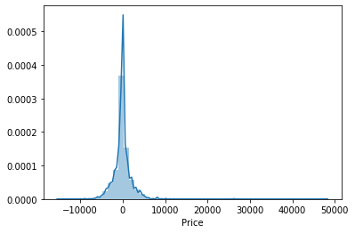

```python
import pandas as pd
import numpy as np
```

## The dataset is in form of xlsx so we use read_excel


```python
train_data=pd.read_excel(r'C:\Users\HP\Documents\machine learning projects\datasets\python datasets\Flight_fare_prediction\train_data.xlsx')
```


```python
train_data.head()
```


<div>
<style scoped>
    .dataframe tbody tr th:only-of-type {
        vertical-align: middle;
    }

    .dataframe tbody tr th {
        vertical-align: top;
    }

    .dataframe thead th {
        text-align: right;
    }
</style>
<table border="1" class="dataframe">
  <thead>
    <tr style="text-align: right;">
      <th></th>
      <th>Airline</th>
      <th>Date_of_Journey</th>
      <th>Source</th>
      <th>Destination</th>
      <th>Route</th>
      <th>Dep_Time</th>
      <th>Arrival_Time</th>
      <th>Duration</th>
      <th>Total_Stops</th>
      <th>Additional_Info</th>
      <th>Price</th>
    </tr>
  </thead>
  <tbody>
    <tr>
      <th>0</th>
      <td>IndiGo</td>
      <td>24/03/2019</td>
      <td>Banglore</td>
      <td>New Delhi</td>
      <td>BLR → DEL</td>
      <td>22:20</td>
      <td>01:10 22 Mar</td>
      <td>2h 50m</td>
      <td>non-stop</td>
      <td>No info</td>
      <td>3897</td>
    </tr>
    <tr>
      <th>1</th>
      <td>Air India</td>
      <td>1/05/2019</td>
      <td>Kolkata</td>
      <td>Banglore</td>
      <td>CCU → IXR → BBI → BLR</td>
      <td>05:50</td>
      <td>13:15</td>
      <td>7h 25m</td>
      <td>2 stops</td>
      <td>No info</td>
      <td>7662</td>
    </tr>
    <tr>
      <th>2</th>
      <td>Jet Airways</td>
      <td>9/06/2019</td>
      <td>Delhi</td>
      <td>Cochin</td>
      <td>DEL → LKO → BOM → COK</td>
      <td>09:25</td>
      <td>04:25 10 Jun</td>
      <td>19h</td>
      <td>2 stops</td>
      <td>No info</td>
      <td>13882</td>
    </tr>
    <tr>
      <th>3</th>
      <td>IndiGo</td>
      <td>12/05/2019</td>
      <td>Kolkata</td>
      <td>Banglore</td>
      <td>CCU → NAG → BLR</td>
      <td>18:05</td>
      <td>23:30</td>
      <td>5h 25m</td>
      <td>1 stop</td>
      <td>No info</td>
      <td>6218</td>
    </tr>
    <tr>
      <th>4</th>
      <td>IndiGo</td>
      <td>01/03/2019</td>
      <td>Banglore</td>
      <td>New Delhi</td>
      <td>BLR → NAG → DEL</td>
      <td>16:50</td>
      <td>21:35</td>
      <td>4h 45m</td>
      <td>1 stop</td>
      <td>No info</td>
      <td>13302</td>
    </tr>
  </tbody>
</table>
</div>


```python
train_data.info()
```

    <class 'pandas.core.frame.DataFrame'>
    RangeIndex: 10683 entries, 0 to 10682
    Data columns (total 11 columns):
    Airline            10683 non-null object
    Date_of_Journey    10683 non-null object
    Source             10683 non-null object
    Destination        10683 non-null object
    Route              10682 non-null object
    Dep_Time           10683 non-null object
    Arrival_Time       10683 non-null object
    Duration           10683 non-null object
    Total_Stops        10682 non-null object
    Additional_Info    10683 non-null object
    Price              10683 non-null int64
    dtypes: int64(1), object(10)
    memory usage: 918.1+ KB
    


```python
train_data.dropna(inplace=True)
```


```python
train_data.isnull().sum()
```


    Airline            0
    Date_of_Journey    0
    Source             0
    Destination        0
    Route              0
    Dep_Time           0
    Arrival_Time       0
    Duration           0
    Total_Stops        0
    Additional_Info    0
    Price              0
    dtype: int64


```python
train_data.shape
```


    (10682, 11)


## Date_of_Journey is object column so we transform it to int by taking only the day and month seperately


```python
train_data['Journey_day']=pd.to_datetime(train_data['Date_of_Journey'],format="%d/%m/%Y").dt.day
```


```python
train_data['Journey_month']=pd.to_datetime(train_data['Date_of_Journey'],format="%d/%m/%Y").dt.month
```


```python
train_data.head()
```


<div>
<style scoped>
    .dataframe tbody tr th:only-of-type {
        vertical-align: middle;
    }

    .dataframe tbody tr th {
        vertical-align: top;
    }

    .dataframe thead th {
        text-align: right;
    }
</style>
<table border="1" class="dataframe">
  <thead>
    <tr style="text-align: right;">
      <th></th>
      <th>Airline</th>
      <th>Date_of_Journey</th>
      <th>Source</th>
      <th>Destination</th>
      <th>Route</th>
      <th>Dep_Time</th>
      <th>Arrival_Time</th>
      <th>Duration</th>
      <th>Total_Stops</th>
      <th>Additional_Info</th>
      <th>Price</th>
      <th>Journey_day</th>
      <th>Journey_month</th>
    </tr>
  </thead>
  <tbody>
    <tr>
      <th>0</th>
      <td>IndiGo</td>
      <td>24/03/2019</td>
      <td>Banglore</td>
      <td>New Delhi</td>
      <td>BLR → DEL</td>
      <td>22:20</td>
      <td>01:10 22 Mar</td>
      <td>2h 50m</td>
      <td>non-stop</td>
      <td>No info</td>
      <td>3897</td>
      <td>24</td>
      <td>3</td>
    </tr>
    <tr>
      <th>1</th>
      <td>Air India</td>
      <td>1/05/2019</td>
      <td>Kolkata</td>
      <td>Banglore</td>
      <td>CCU → IXR → BBI → BLR</td>
      <td>05:50</td>
      <td>13:15</td>
      <td>7h 25m</td>
      <td>2 stops</td>
      <td>No info</td>
      <td>7662</td>
      <td>1</td>
      <td>5</td>
    </tr>
    <tr>
      <th>2</th>
      <td>Jet Airways</td>
      <td>9/06/2019</td>
      <td>Delhi</td>
      <td>Cochin</td>
      <td>DEL → LKO → BOM → COK</td>
      <td>09:25</td>
      <td>04:25 10 Jun</td>
      <td>19h</td>
      <td>2 stops</td>
      <td>No info</td>
      <td>13882</td>
      <td>9</td>
      <td>6</td>
    </tr>
    <tr>
      <th>3</th>
      <td>IndiGo</td>
      <td>12/05/2019</td>
      <td>Kolkata</td>
      <td>Banglore</td>
      <td>CCU → NAG → BLR</td>
      <td>18:05</td>
      <td>23:30</td>
      <td>5h 25m</td>
      <td>1 stop</td>
      <td>No info</td>
      <td>6218</td>
      <td>12</td>
      <td>5</td>
    </tr>
    <tr>
      <th>4</th>
      <td>IndiGo</td>
      <td>01/03/2019</td>
      <td>Banglore</td>
      <td>New Delhi</td>
      <td>BLR → NAG → DEL</td>
      <td>16:50</td>
      <td>21:35</td>
      <td>4h 45m</td>
      <td>1 stop</td>
      <td>No info</td>
      <td>13302</td>
      <td>1</td>
      <td>3</td>
    </tr>
  </tbody>
</table>
</div>


```python
a=pd.to_datetime(train_data['Date_of_Journey']).dt.year
```


```python
a.value_counts()
```


    2019    10682
    Name: Date_of_Journey, dtype: int64


## From the above code we come to know that the dataset is only for 2019 so we don't take year seperately.......We drop the 'Date_of_Journey' column


```python
train_data.drop(['Date_of_Journey'],axis=1,inplace=True)
```


```python
train_data.head()
```


<div>
<style scoped>
    .dataframe tbody tr th:only-of-type {
        vertical-align: middle;
    }

    .dataframe tbody tr th {
        vertical-align: top;
    }

    .dataframe thead th {
        text-align: right;
    }
</style>
<table border="1" class="dataframe">
  <thead>
    <tr style="text-align: right;">
      <th></th>
      <th>Airline</th>
      <th>Source</th>
      <th>Destination</th>
      <th>Route</th>
      <th>Dep_Time</th>
      <th>Arrival_Time</th>
      <th>Duration</th>
      <th>Total_Stops</th>
      <th>Additional_Info</th>
      <th>Price</th>
      <th>Journey_day</th>
      <th>Journey_month</th>
    </tr>
  </thead>
  <tbody>
    <tr>
      <th>0</th>
      <td>IndiGo</td>
      <td>Banglore</td>
      <td>New Delhi</td>
      <td>BLR → DEL</td>
      <td>22:20</td>
      <td>01:10 22 Mar</td>
      <td>2h 50m</td>
      <td>non-stop</td>
      <td>No info</td>
      <td>3897</td>
      <td>24</td>
      <td>3</td>
    </tr>
    <tr>
      <th>1</th>
      <td>Air India</td>
      <td>Kolkata</td>
      <td>Banglore</td>
      <td>CCU → IXR → BBI → BLR</td>
      <td>05:50</td>
      <td>13:15</td>
      <td>7h 25m</td>
      <td>2 stops</td>
      <td>No info</td>
      <td>7662</td>
      <td>1</td>
      <td>5</td>
    </tr>
    <tr>
      <th>2</th>
      <td>Jet Airways</td>
      <td>Delhi</td>
      <td>Cochin</td>
      <td>DEL → LKO → BOM → COK</td>
      <td>09:25</td>
      <td>04:25 10 Jun</td>
      <td>19h</td>
      <td>2 stops</td>
      <td>No info</td>
      <td>13882</td>
      <td>9</td>
      <td>6</td>
    </tr>
    <tr>
      <th>3</th>
      <td>IndiGo</td>
      <td>Kolkata</td>
      <td>Banglore</td>
      <td>CCU → NAG → BLR</td>
      <td>18:05</td>
      <td>23:30</td>
      <td>5h 25m</td>
      <td>1 stop</td>
      <td>No info</td>
      <td>6218</td>
      <td>12</td>
      <td>5</td>
    </tr>
    <tr>
      <th>4</th>
      <td>IndiGo</td>
      <td>Banglore</td>
      <td>New Delhi</td>
      <td>BLR → NAG → DEL</td>
      <td>16:50</td>
      <td>21:35</td>
      <td>4h 45m</td>
      <td>1 stop</td>
      <td>No info</td>
      <td>13302</td>
      <td>1</td>
      <td>3</td>
    </tr>
  </tbody>
</table>
</div>


## dept time is also object so we convert it into int in the same way


```python
train_data['Dep_hour']=pd.to_datetime(train_data['Dep_Time']).dt.hour
```


```python
train_data['Dep_min']=pd.to_datetime(train_data['Dep_Time']).dt.minute
```


```python
train_data.drop(['Dep_Time'],axis=1,inplace=True)
```


```python
train_data.head()
```


<div>
<style scoped>
    .dataframe tbody tr th:only-of-type {
        vertical-align: middle;
    }

    .dataframe tbody tr th {
        vertical-align: top;
    }

    .dataframe thead th {
        text-align: right;
    }
</style>
<table border="1" class="dataframe">
  <thead>
    <tr style="text-align: right;">
      <th></th>
      <th>Airline</th>
      <th>Source</th>
      <th>Destination</th>
      <th>Route</th>
      <th>Arrival_Time</th>
      <th>Duration</th>
      <th>Total_Stops</th>
      <th>Additional_Info</th>
      <th>Price</th>
      <th>Journey_day</th>
      <th>Journey_month</th>
      <th>Dep_hour</th>
      <th>Dep_min</th>
    </tr>
  </thead>
  <tbody>
    <tr>
      <th>0</th>
      <td>IndiGo</td>
      <td>Banglore</td>
      <td>New Delhi</td>
      <td>BLR → DEL</td>
      <td>01:10 22 Mar</td>
      <td>2h 50m</td>
      <td>non-stop</td>
      <td>No info</td>
      <td>3897</td>
      <td>24</td>
      <td>3</td>
      <td>22</td>
      <td>20</td>
    </tr>
    <tr>
      <th>1</th>
      <td>Air India</td>
      <td>Kolkata</td>
      <td>Banglore</td>
      <td>CCU → IXR → BBI → BLR</td>
      <td>13:15</td>
      <td>7h 25m</td>
      <td>2 stops</td>
      <td>No info</td>
      <td>7662</td>
      <td>1</td>
      <td>5</td>
      <td>5</td>
      <td>50</td>
    </tr>
    <tr>
      <th>2</th>
      <td>Jet Airways</td>
      <td>Delhi</td>
      <td>Cochin</td>
      <td>DEL → LKO → BOM → COK</td>
      <td>04:25 10 Jun</td>
      <td>19h</td>
      <td>2 stops</td>
      <td>No info</td>
      <td>13882</td>
      <td>9</td>
      <td>6</td>
      <td>9</td>
      <td>25</td>
    </tr>
    <tr>
      <th>3</th>
      <td>IndiGo</td>
      <td>Kolkata</td>
      <td>Banglore</td>
      <td>CCU → NAG → BLR</td>
      <td>23:30</td>
      <td>5h 25m</td>
      <td>1 stop</td>
      <td>No info</td>
      <td>6218</td>
      <td>12</td>
      <td>5</td>
      <td>18</td>
      <td>5</td>
    </tr>
    <tr>
      <th>4</th>
      <td>IndiGo</td>
      <td>Banglore</td>
      <td>New Delhi</td>
      <td>BLR → NAG → DEL</td>
      <td>21:35</td>
      <td>4h 45m</td>
      <td>1 stop</td>
      <td>No info</td>
      <td>13302</td>
      <td>1</td>
      <td>3</td>
      <td>16</td>
      <td>50</td>
    </tr>
  </tbody>
</table>
</div>


```python
train_data['Arrival_hour']=pd.to_datetime(train_data['Arrival_Time']).dt.hour
train_data['Arrival_min']=pd.to_datetime(train_data['Arrival_Time']).dt.minute
train_data.drop(['Arrival_Time'],axis=1,inplace=True)
```


```python
train_data.head()
```


<div>
<style scoped>
    .dataframe tbody tr th:only-of-type {
        vertical-align: middle;
    }

    .dataframe tbody tr th {
        vertical-align: top;
    }

    .dataframe thead th {
        text-align: right;
    }
</style>
<table border="1" class="dataframe">
  <thead>
    <tr style="text-align: right;">
      <th></th>
      <th>Airline</th>
      <th>Source</th>
      <th>Destination</th>
      <th>Route</th>
      <th>Duration</th>
      <th>Total_Stops</th>
      <th>Additional_Info</th>
      <th>Price</th>
      <th>Journey_day</th>
      <th>Journey_month</th>
      <th>Dep_hour</th>
      <th>Dep_min</th>
      <th>Arrival_hour</th>
      <th>Arrival_min</th>
    </tr>
  </thead>
  <tbody>
    <tr>
      <th>0</th>
      <td>IndiGo</td>
      <td>Banglore</td>
      <td>New Delhi</td>
      <td>BLR → DEL</td>
      <td>2h 50m</td>
      <td>non-stop</td>
      <td>No info</td>
      <td>3897</td>
      <td>24</td>
      <td>3</td>
      <td>22</td>
      <td>20</td>
      <td>1</td>
      <td>10</td>
    </tr>
    <tr>
      <th>1</th>
      <td>Air India</td>
      <td>Kolkata</td>
      <td>Banglore</td>
      <td>CCU → IXR → BBI → BLR</td>
      <td>7h 25m</td>
      <td>2 stops</td>
      <td>No info</td>
      <td>7662</td>
      <td>1</td>
      <td>5</td>
      <td>5</td>
      <td>50</td>
      <td>13</td>
      <td>15</td>
    </tr>
    <tr>
      <th>2</th>
      <td>Jet Airways</td>
      <td>Delhi</td>
      <td>Cochin</td>
      <td>DEL → LKO → BOM → COK</td>
      <td>19h</td>
      <td>2 stops</td>
      <td>No info</td>
      <td>13882</td>
      <td>9</td>
      <td>6</td>
      <td>9</td>
      <td>25</td>
      <td>4</td>
      <td>25</td>
    </tr>
    <tr>
      <th>3</th>
      <td>IndiGo</td>
      <td>Kolkata</td>
      <td>Banglore</td>
      <td>CCU → NAG → BLR</td>
      <td>5h 25m</td>
      <td>1 stop</td>
      <td>No info</td>
      <td>6218</td>
      <td>12</td>
      <td>5</td>
      <td>18</td>
      <td>5</td>
      <td>23</td>
      <td>30</td>
    </tr>
    <tr>
      <th>4</th>
      <td>IndiGo</td>
      <td>Banglore</td>
      <td>New Delhi</td>
      <td>BLR → NAG → DEL</td>
      <td>4h 45m</td>
      <td>1 stop</td>
      <td>No info</td>
      <td>13302</td>
      <td>1</td>
      <td>3</td>
      <td>16</td>
      <td>50</td>
      <td>21</td>
      <td>35</td>
    </tr>
  </tbody>
</table>
</div>


## Duration is also object but we cannot use datetime to this as it has 'h' and 'm' ....so we write the below function


```python
duration=list(train_data['Duration'])
#print(duration)
for i in range(len(duration)):
    if len(duration[i].split())!=2:
        if 'h' in duration[i]:
            duration[i]=duration[i].strip()+' 0m'
        else:
            duration[i]='0h '+ duration[i]
#print(duration)
duration_hours=[]  
duration_minutes=[]
for i in range(len(duration)):
    duration_hours.append(int(duration[i].split(sep='h')[0]))
    duration_minutes.append(int(duration[i].split(sep='m')[0].split()[1]))

#print(duration_minutes)
```


```python
train_data['Duration_hours']=duration_hours
train_data['Duration_minutes']=duration_minutes

```


```python
train_data.head()
```


<div>
<style scoped>
    .dataframe tbody tr th:only-of-type {
        vertical-align: middle;
    }

    .dataframe tbody tr th {
        vertical-align: top;
    }

    .dataframe thead th {
        text-align: right;
    }
</style>
<table border="1" class="dataframe">
  <thead>
    <tr style="text-align: right;">
      <th></th>
      <th>Airline</th>
      <th>Source</th>
      <th>Destination</th>
      <th>Route</th>
      <th>Duration</th>
      <th>Total_Stops</th>
      <th>Additional_Info</th>
      <th>Price</th>
      <th>Journey_day</th>
      <th>Journey_month</th>
      <th>Dep_hour</th>
      <th>Dep_min</th>
      <th>Arrival_hour</th>
      <th>Arrival_min</th>
      <th>Duration_hours</th>
      <th>Duration_minutes</th>
    </tr>
  </thead>
  <tbody>
    <tr>
      <th>0</th>
      <td>IndiGo</td>
      <td>Banglore</td>
      <td>New Delhi</td>
      <td>BLR → DEL</td>
      <td>2h 50m</td>
      <td>non-stop</td>
      <td>No info</td>
      <td>3897</td>
      <td>24</td>
      <td>3</td>
      <td>22</td>
      <td>20</td>
      <td>1</td>
      <td>10</td>
      <td>2</td>
      <td>50</td>
    </tr>
    <tr>
      <th>1</th>
      <td>Air India</td>
      <td>Kolkata</td>
      <td>Banglore</td>
      <td>CCU → IXR → BBI → BLR</td>
      <td>7h 25m</td>
      <td>2 stops</td>
      <td>No info</td>
      <td>7662</td>
      <td>1</td>
      <td>5</td>
      <td>5</td>
      <td>50</td>
      <td>13</td>
      <td>15</td>
      <td>7</td>
      <td>25</td>
    </tr>
    <tr>
      <th>2</th>
      <td>Jet Airways</td>
      <td>Delhi</td>
      <td>Cochin</td>
      <td>DEL → LKO → BOM → COK</td>
      <td>19h</td>
      <td>2 stops</td>
      <td>No info</td>
      <td>13882</td>
      <td>9</td>
      <td>6</td>
      <td>9</td>
      <td>25</td>
      <td>4</td>
      <td>25</td>
      <td>19</td>
      <td>0</td>
    </tr>
    <tr>
      <th>3</th>
      <td>IndiGo</td>
      <td>Kolkata</td>
      <td>Banglore</td>
      <td>CCU → NAG → BLR</td>
      <td>5h 25m</td>
      <td>1 stop</td>
      <td>No info</td>
      <td>6218</td>
      <td>12</td>
      <td>5</td>
      <td>18</td>
      <td>5</td>
      <td>23</td>
      <td>30</td>
      <td>5</td>
      <td>25</td>
    </tr>
    <tr>
      <th>4</th>
      <td>IndiGo</td>
      <td>Banglore</td>
      <td>New Delhi</td>
      <td>BLR → NAG → DEL</td>
      <td>4h 45m</td>
      <td>1 stop</td>
      <td>No info</td>
      <td>13302</td>
      <td>1</td>
      <td>3</td>
      <td>16</td>
      <td>50</td>
      <td>21</td>
      <td>35</td>
      <td>4</td>
      <td>45</td>
    </tr>
  </tbody>
</table>
</div>


```python
train_data.drop(['Duration'],axis=1,inplace=True)
```


```python
train_data.head()
```


<div>
<style scoped>
    .dataframe tbody tr th:only-of-type {
        vertical-align: middle;
    }

    .dataframe tbody tr th {
        vertical-align: top;
    }

    .dataframe thead th {
        text-align: right;
    }
</style>
<table border="1" class="dataframe">
  <thead>
    <tr style="text-align: right;">
      <th></th>
      <th>Airline</th>
      <th>Source</th>
      <th>Destination</th>
      <th>Route</th>
      <th>Total_Stops</th>
      <th>Additional_Info</th>
      <th>Price</th>
      <th>Journey_day</th>
      <th>Journey_month</th>
      <th>Dep_hour</th>
      <th>Dep_min</th>
      <th>Arrival_hour</th>
      <th>Arrival_min</th>
      <th>Duration_hours</th>
      <th>Duration_minutes</th>
    </tr>
  </thead>
  <tbody>
    <tr>
      <th>0</th>
      <td>IndiGo</td>
      <td>Banglore</td>
      <td>New Delhi</td>
      <td>BLR → DEL</td>
      <td>non-stop</td>
      <td>No info</td>
      <td>3897</td>
      <td>24</td>
      <td>3</td>
      <td>22</td>
      <td>20</td>
      <td>1</td>
      <td>10</td>
      <td>2</td>
      <td>50</td>
    </tr>
    <tr>
      <th>1</th>
      <td>Air India</td>
      <td>Kolkata</td>
      <td>Banglore</td>
      <td>CCU → IXR → BBI → BLR</td>
      <td>2 stops</td>
      <td>No info</td>
      <td>7662</td>
      <td>1</td>
      <td>5</td>
      <td>5</td>
      <td>50</td>
      <td>13</td>
      <td>15</td>
      <td>7</td>
      <td>25</td>
    </tr>
    <tr>
      <th>2</th>
      <td>Jet Airways</td>
      <td>Delhi</td>
      <td>Cochin</td>
      <td>DEL → LKO → BOM → COK</td>
      <td>2 stops</td>
      <td>No info</td>
      <td>13882</td>
      <td>9</td>
      <td>6</td>
      <td>9</td>
      <td>25</td>
      <td>4</td>
      <td>25</td>
      <td>19</td>
      <td>0</td>
    </tr>
    <tr>
      <th>3</th>
      <td>IndiGo</td>
      <td>Kolkata</td>
      <td>Banglore</td>
      <td>CCU → NAG → BLR</td>
      <td>1 stop</td>
      <td>No info</td>
      <td>6218</td>
      <td>12</td>
      <td>5</td>
      <td>18</td>
      <td>5</td>
      <td>23</td>
      <td>30</td>
      <td>5</td>
      <td>25</td>
    </tr>
    <tr>
      <th>4</th>
      <td>IndiGo</td>
      <td>Banglore</td>
      <td>New Delhi</td>
      <td>BLR → NAG → DEL</td>
      <td>1 stop</td>
      <td>No info</td>
      <td>13302</td>
      <td>1</td>
      <td>3</td>
      <td>16</td>
      <td>50</td>
      <td>21</td>
      <td>35</td>
      <td>4</td>
      <td>45</td>
    </tr>
  </tbody>
</table>
</div>


## Inference--------->Now we have preprocessed all the the date time columns........ 

##  Seeing which Airline has high price


```python
import matplotlib.pyplot as plt
```


```python
train_data.groupby(['Airline'])['Price'].median().plot.bar()
plt.show()
```


## Inference------->Jet Airlines Business has high price and others have similar median price

## Preprocessing categorical columns
## 1) First,we perform encoding techniques to each column seperately 
## 2) Then we concat all the columns together with the dataset

###  Airline---------As Airlines is nominal,we perform oneHotEncoding to this column


```python
Airlines=train_data[['Airline']]
print(Airlines)
```

                     Airline
    0                 IndiGo
    1              Air India
    2            Jet Airways
    3                 IndiGo
    4                 IndiGo
    5               SpiceJet
    6            Jet Airways
    7            Jet Airways
    8            Jet Airways
    9      Multiple carriers
    10             Air India
    11                IndiGo
    12             Air India
    13           Jet Airways
    14                IndiGo
    15             Air India
    16              SpiceJet
    17           Jet Airways
    18             Air India
    19           Jet Airways
    20                 GoAir
    21             Air India
    22                IndiGo
    23                IndiGo
    24           Jet Airways
    25           Jet Airways
    26                IndiGo
    27                 GoAir
    28               Vistara
    29               Vistara
    ...                  ...
    10653        Jet Airways
    10654           SpiceJet
    10655        Jet Airways
    10656            Vistara
    10657        Jet Airways
    10658        Jet Airways
    10659            Vistara
    10660            Vistara
    10661          Air India
    10662          Air India
    10663        Jet Airways
    10664             IndiGo
    10665             IndiGo
    10666        Jet Airways
    10667        Jet Airways
    10668        Jet Airways
    10669          Air India
    10670          Air India
    10671          Air India
    10672        Jet Airways
    10673        Jet Airways
    10674        Jet Airways
    10675          Air India
    10676  Multiple carriers
    10677           SpiceJet
    10678           Air Asia
    10679          Air India
    10680        Jet Airways
    10681            Vistara
    10682          Air India
    
    [10682 rows x 1 columns]
    


```python
Airlines=pd.get_dummies(Airlines,drop_first=True)
```


```python
Airlines.head()
```


<div>
<style scoped>
    .dataframe tbody tr th:only-of-type {
        vertical-align: middle;
    }

    .dataframe tbody tr th {
        vertical-align: top;
    }

    .dataframe thead th {
        text-align: right;
    }
</style>
<table border="1" class="dataframe">
  <thead>
    <tr style="text-align: right;">
      <th></th>
      <th>Airline_Air India</th>
      <th>Airline_GoAir</th>
      <th>Airline_IndiGo</th>
      <th>Airline_Jet Airways</th>
      <th>Airline_Jet Airways Business</th>
      <th>Airline_Multiple carriers</th>
      <th>Airline_Multiple carriers Premium economy</th>
      <th>Airline_SpiceJet</th>
      <th>Airline_Trujet</th>
      <th>Airline_Vistara</th>
      <th>Airline_Vistara Premium economy</th>
    </tr>
  </thead>
  <tbody>
    <tr>
      <th>0</th>
      <td>0</td>
      <td>0</td>
      <td>1</td>
      <td>0</td>
      <td>0</td>
      <td>0</td>
      <td>0</td>
      <td>0</td>
      <td>0</td>
      <td>0</td>
      <td>0</td>
    </tr>
    <tr>
      <th>1</th>
      <td>1</td>
      <td>0</td>
      <td>0</td>
      <td>0</td>
      <td>0</td>
      <td>0</td>
      <td>0</td>
      <td>0</td>
      <td>0</td>
      <td>0</td>
      <td>0</td>
    </tr>
    <tr>
      <th>2</th>
      <td>0</td>
      <td>0</td>
      <td>0</td>
      <td>1</td>
      <td>0</td>
      <td>0</td>
      <td>0</td>
      <td>0</td>
      <td>0</td>
      <td>0</td>
      <td>0</td>
    </tr>
    <tr>
      <th>3</th>
      <td>0</td>
      <td>0</td>
      <td>1</td>
      <td>0</td>
      <td>0</td>
      <td>0</td>
      <td>0</td>
      <td>0</td>
      <td>0</td>
      <td>0</td>
      <td>0</td>
    </tr>
    <tr>
      <th>4</th>
      <td>0</td>
      <td>0</td>
      <td>1</td>
      <td>0</td>
      <td>0</td>
      <td>0</td>
      <td>0</td>
      <td>0</td>
      <td>0</td>
      <td>0</td>
      <td>0</td>
    </tr>
  </tbody>
</table>
</div>


## Visualizing source with price


```python
train_data['Source'].value_counts()
```


    Delhi       4536
    Kolkata     2871
    Banglore    2197
    Mumbai       697
    Chennai      381
    Name: Source, dtype: int64


```python
train_data.groupby(['Source'])['Price'].median().plot.bar()
plt.show()
```


## Inference -----Travelling from Delhi,Kolkatta the price is high

### Source ----As Source is nominal,we perform oneHotEncoding to this column


```python
Source=train_data[['Source']]
```


```python
Source=pd.get_dummies(Source,drop_first=True)
```


```python
Source.head()
```


<div>
<style scoped>
    .dataframe tbody tr th:only-of-type {
        vertical-align: middle;
    }

    .dataframe tbody tr th {
        vertical-align: top;
    }

    .dataframe thead th {
        text-align: right;
    }
</style>
<table border="1" class="dataframe">
  <thead>
    <tr style="text-align: right;">
      <th></th>
      <th>Source_Chennai</th>
      <th>Source_Delhi</th>
      <th>Source_Kolkata</th>
      <th>Source_Mumbai</th>
    </tr>
  </thead>
  <tbody>
    <tr>
      <th>0</th>
      <td>0</td>
      <td>0</td>
      <td>0</td>
      <td>0</td>
    </tr>
    <tr>
      <th>1</th>
      <td>0</td>
      <td>0</td>
      <td>1</td>
      <td>0</td>
    </tr>
    <tr>
      <th>2</th>
      <td>0</td>
      <td>1</td>
      <td>0</td>
      <td>0</td>
    </tr>
    <tr>
      <th>3</th>
      <td>0</td>
      <td>0</td>
      <td>1</td>
      <td>0</td>
    </tr>
    <tr>
      <th>4</th>
      <td>0</td>
      <td>0</td>
      <td>0</td>
      <td>0</td>
    </tr>
  </tbody>
</table>
</div>


## Visualizing destination with price


```python
train_data['Destination'].value_counts()
```


    Cochin       4536
    Banglore     2871
    Delhi        1265
    New Delhi     932
    Hyderabad     697
    Kolkata       381
    Name: Destination, dtype: int64


## Since there are 2 cols delhi and new delhi,we make them together as delhi


```python
destination=list(train_data['Destination'])
for i in range(len(destination)):
    if(destination[i]=='New Delhi'):
        destination[i]='Delhi'
```


```python
Destination=[]
for i in range(len(destination)):
    Destination.append(destination[i])
```


```python
train_data['dest']=Destination
train_data['dest'].value_counts()
```


    Cochin       4536
    Banglore     2871
    Delhi        2197
    Hyderabad     697
    Kolkata       381
    Name: dest, dtype: int64


```python
train_data.groupby(['dest'])['Price'].median().plot.bar()
plt.show()
```


## Inference-----If your destination is Delhi,Cochin then price is high

### Destination-------As destination is nominal,we perform oneHotEncoding to this column


```python
Destination=train_data[['dest']]
```


```python
Destination=pd.get_dummies(Destination,drop_first=True)
```


```python
Destination.head()
```


<div>
<style scoped>
    .dataframe tbody tr th:only-of-type {
        vertical-align: middle;
    }

    .dataframe tbody tr th {
        vertical-align: top;
    }

    .dataframe thead th {
        text-align: right;
    }
</style>
<table border="1" class="dataframe">
  <thead>
    <tr style="text-align: right;">
      <th></th>
      <th>dest_Cochin</th>
      <th>dest_Delhi</th>
      <th>dest_Hyderabad</th>
      <th>dest_Kolkata</th>
    </tr>
  </thead>
  <tbody>
    <tr>
      <th>0</th>
      <td>0</td>
      <td>1</td>
      <td>0</td>
      <td>0</td>
    </tr>
    <tr>
      <th>1</th>
      <td>0</td>
      <td>0</td>
      <td>0</td>
      <td>0</td>
    </tr>
    <tr>
      <th>2</th>
      <td>1</td>
      <td>0</td>
      <td>0</td>
      <td>0</td>
    </tr>
    <tr>
      <th>3</th>
      <td>0</td>
      <td>0</td>
      <td>0</td>
      <td>0</td>
    </tr>
    <tr>
      <th>4</th>
      <td>0</td>
      <td>1</td>
      <td>0</td>
      <td>0</td>
    </tr>
  </tbody>
</table>
</div>


### -----Route and total stops tell the same information -------so,we drop the route column


```python
train_data[['Route','Total_Stops']]
```


<div>
<style scoped>
    .dataframe tbody tr th:only-of-type {
        vertical-align: middle;
    }

    .dataframe tbody tr th {
        vertical-align: top;
    }

    .dataframe thead th {
        text-align: right;
    }
</style>
<table border="1" class="dataframe">
  <thead>
    <tr style="text-align: right;">
      <th></th>
      <th>Route</th>
      <th>Total_Stops</th>
    </tr>
  </thead>
  <tbody>
    <tr>
      <th>0</th>
      <td>BLR → DEL</td>
      <td>non-stop</td>
    </tr>
    <tr>
      <th>1</th>
      <td>CCU → IXR → BBI → BLR</td>
      <td>2 stops</td>
    </tr>
    <tr>
      <th>2</th>
      <td>DEL → LKO → BOM → COK</td>
      <td>2 stops</td>
    </tr>
    <tr>
      <th>3</th>
      <td>CCU → NAG → BLR</td>
      <td>1 stop</td>
    </tr>
    <tr>
      <th>4</th>
      <td>BLR → NAG → DEL</td>
      <td>1 stop</td>
    </tr>
    <tr>
      <th>5</th>
      <td>CCU → BLR</td>
      <td>non-stop</td>
    </tr>
    <tr>
      <th>6</th>
      <td>BLR → BOM → DEL</td>
      <td>1 stop</td>
    </tr>
    <tr>
      <th>7</th>
      <td>BLR → BOM → DEL</td>
      <td>1 stop</td>
    </tr>
    <tr>
      <th>8</th>
      <td>BLR → BOM → DEL</td>
      <td>1 stop</td>
    </tr>
    <tr>
      <th>9</th>
      <td>DEL → BOM → COK</td>
      <td>1 stop</td>
    </tr>
    <tr>
      <th>10</th>
      <td>DEL → BLR → COK</td>
      <td>1 stop</td>
    </tr>
    <tr>
      <th>11</th>
      <td>CCU → BLR</td>
      <td>non-stop</td>
    </tr>
    <tr>
      <th>12</th>
      <td>MAA → CCU</td>
      <td>non-stop</td>
    </tr>
    <tr>
      <th>13</th>
      <td>CCU → BOM → BLR</td>
      <td>1 stop</td>
    </tr>
    <tr>
      <th>14</th>
      <td>CCU → BLR</td>
      <td>non-stop</td>
    </tr>
    <tr>
      <th>15</th>
      <td>DEL → AMD → BOM → COK</td>
      <td>2 stops</td>
    </tr>
    <tr>
      <th>16</th>
      <td>DEL → PNQ → COK</td>
      <td>1 stop</td>
    </tr>
    <tr>
      <th>17</th>
      <td>DEL → BOM → COK</td>
      <td>1 stop</td>
    </tr>
    <tr>
      <th>18</th>
      <td>DEL → CCU → BOM → COK</td>
      <td>2 stops</td>
    </tr>
    <tr>
      <th>19</th>
      <td>DEL → BOM → COK</td>
      <td>1 stop</td>
    </tr>
    <tr>
      <th>20</th>
      <td>DEL → BOM → COK</td>
      <td>1 stop</td>
    </tr>
    <tr>
      <th>21</th>
      <td>BLR → COK → DEL</td>
      <td>1 stop</td>
    </tr>
    <tr>
      <th>22</th>
      <td>BLR → DEL</td>
      <td>non-stop</td>
    </tr>
    <tr>
      <th>23</th>
      <td>BLR → DEL</td>
      <td>non-stop</td>
    </tr>
    <tr>
      <th>24</th>
      <td>CCU → BOM → BLR</td>
      <td>1 stop</td>
    </tr>
    <tr>
      <th>25</th>
      <td>DEL → IDR → BOM → COK</td>
      <td>2 stops</td>
    </tr>
    <tr>
      <th>26</th>
      <td>DEL → LKO → COK</td>
      <td>1 stop</td>
    </tr>
    <tr>
      <th>27</th>
      <td>DEL → BOM → COK</td>
      <td>1 stop</td>
    </tr>
    <tr>
      <th>28</th>
      <td>BLR → DEL</td>
      <td>non-stop</td>
    </tr>
    <tr>
      <th>29</th>
      <td>MAA → CCU</td>
      <td>non-stop</td>
    </tr>
    <tr>
      <th>...</th>
      <td>...</td>
      <td>...</td>
    </tr>
    <tr>
      <th>10653</th>
      <td>CCU → BOM → BLR</td>
      <td>1 stop</td>
    </tr>
    <tr>
      <th>10654</th>
      <td>BLR → DEL</td>
      <td>non-stop</td>
    </tr>
    <tr>
      <th>10655</th>
      <td>BOM → HYD</td>
      <td>non-stop</td>
    </tr>
    <tr>
      <th>10656</th>
      <td>BLR → DEL</td>
      <td>non-stop</td>
    </tr>
    <tr>
      <th>10657</th>
      <td>CCU → BOM → BLR</td>
      <td>1 stop</td>
    </tr>
    <tr>
      <th>10658</th>
      <td>BLR → DEL</td>
      <td>non-stop</td>
    </tr>
    <tr>
      <th>10659</th>
      <td>BLR → DEL</td>
      <td>non-stop</td>
    </tr>
    <tr>
      <th>10660</th>
      <td>BLR → DEL</td>
      <td>non-stop</td>
    </tr>
    <tr>
      <th>10661</th>
      <td>DEL → BOM → COK</td>
      <td>1 stop</td>
    </tr>
    <tr>
      <th>10662</th>
      <td>CCU → BOM → GOI → BLR</td>
      <td>2 stops</td>
    </tr>
    <tr>
      <th>10663</th>
      <td>DEL → JAI → BOM → COK</td>
      <td>2 stops</td>
    </tr>
    <tr>
      <th>10664</th>
      <td>BLR → DEL</td>
      <td>non-stop</td>
    </tr>
    <tr>
      <th>10665</th>
      <td>CCU → BLR</td>
      <td>non-stop</td>
    </tr>
    <tr>
      <th>10666</th>
      <td>DEL → BOM → COK</td>
      <td>1 stop</td>
    </tr>
    <tr>
      <th>10667</th>
      <td>BLR → BOM → DEL</td>
      <td>1 stop</td>
    </tr>
    <tr>
      <th>10668</th>
      <td>DEL → JDH → BOM → COK</td>
      <td>2 stops</td>
    </tr>
    <tr>
      <th>10669</th>
      <td>DEL → BOM → COK</td>
      <td>1 stop</td>
    </tr>
    <tr>
      <th>10670</th>
      <td>CCU → IXR → DEL → BLR</td>
      <td>2 stops</td>
    </tr>
    <tr>
      <th>10671</th>
      <td>BOM → HYD</td>
      <td>non-stop</td>
    </tr>
    <tr>
      <th>10672</th>
      <td>DEL → AMD → BOM → COK</td>
      <td>2 stops</td>
    </tr>
    <tr>
      <th>10673</th>
      <td>DEL → AMD → BOM → COK</td>
      <td>2 stops</td>
    </tr>
    <tr>
      <th>10674</th>
      <td>BLR → BOM → DEL</td>
      <td>1 stop</td>
    </tr>
    <tr>
      <th>10675</th>
      <td>BOM → HYD</td>
      <td>non-stop</td>
    </tr>
    <tr>
      <th>10676</th>
      <td>DEL → BOM → COK</td>
      <td>1 stop</td>
    </tr>
    <tr>
      <th>10677</th>
      <td>BLR → DEL</td>
      <td>non-stop</td>
    </tr>
    <tr>
      <th>10678</th>
      <td>CCU → BLR</td>
      <td>non-stop</td>
    </tr>
    <tr>
      <th>10679</th>
      <td>CCU → BLR</td>
      <td>non-stop</td>
    </tr>
    <tr>
      <th>10680</th>
      <td>BLR → DEL</td>
      <td>non-stop</td>
    </tr>
    <tr>
      <th>10681</th>
      <td>BLR → DEL</td>
      <td>non-stop</td>
    </tr>
    <tr>
      <th>10682</th>
      <td>DEL → GOI → BOM → COK</td>
      <td>2 stops</td>
    </tr>
  </tbody>
</table>
<p>10682 rows × 2 columns</p>
</div>


```python
train_data.drop(['Route'],axis=1,inplace=True)
```


```python
train_data.head()
```


<div>
<style scoped>
    .dataframe tbody tr th:only-of-type {
        vertical-align: middle;
    }

    .dataframe tbody tr th {
        vertical-align: top;
    }

    .dataframe thead th {
        text-align: right;
    }
</style>
<table border="1" class="dataframe">
  <thead>
    <tr style="text-align: right;">
      <th></th>
      <th>Airline</th>
      <th>Source</th>
      <th>Destination</th>
      <th>Total_Stops</th>
      <th>Additional_Info</th>
      <th>Price</th>
      <th>Journey_day</th>
      <th>Journey_month</th>
      <th>Dep_hour</th>
      <th>Dep_min</th>
      <th>Arrival_hour</th>
      <th>Arrival_min</th>
      <th>Duration_hours</th>
      <th>Duration_minutes</th>
      <th>dest</th>
    </tr>
  </thead>
  <tbody>
    <tr>
      <th>0</th>
      <td>IndiGo</td>
      <td>Banglore</td>
      <td>New Delhi</td>
      <td>non-stop</td>
      <td>No info</td>
      <td>3897</td>
      <td>24</td>
      <td>3</td>
      <td>22</td>
      <td>20</td>
      <td>1</td>
      <td>10</td>
      <td>2</td>
      <td>50</td>
      <td>Delhi</td>
    </tr>
    <tr>
      <th>1</th>
      <td>Air India</td>
      <td>Kolkata</td>
      <td>Banglore</td>
      <td>2 stops</td>
      <td>No info</td>
      <td>7662</td>
      <td>1</td>
      <td>5</td>
      <td>5</td>
      <td>50</td>
      <td>13</td>
      <td>15</td>
      <td>7</td>
      <td>25</td>
      <td>Banglore</td>
    </tr>
    <tr>
      <th>2</th>
      <td>Jet Airways</td>
      <td>Delhi</td>
      <td>Cochin</td>
      <td>2 stops</td>
      <td>No info</td>
      <td>13882</td>
      <td>9</td>
      <td>6</td>
      <td>9</td>
      <td>25</td>
      <td>4</td>
      <td>25</td>
      <td>19</td>
      <td>0</td>
      <td>Cochin</td>
    </tr>
    <tr>
      <th>3</th>
      <td>IndiGo</td>
      <td>Kolkata</td>
      <td>Banglore</td>
      <td>1 stop</td>
      <td>No info</td>
      <td>6218</td>
      <td>12</td>
      <td>5</td>
      <td>18</td>
      <td>5</td>
      <td>23</td>
      <td>30</td>
      <td>5</td>
      <td>25</td>
      <td>Banglore</td>
    </tr>
    <tr>
      <th>4</th>
      <td>IndiGo</td>
      <td>Banglore</td>
      <td>New Delhi</td>
      <td>1 stop</td>
      <td>No info</td>
      <td>13302</td>
      <td>1</td>
      <td>3</td>
      <td>16</td>
      <td>50</td>
      <td>21</td>
      <td>35</td>
      <td>4</td>
      <td>45</td>
      <td>Delhi</td>
    </tr>
  </tbody>
</table>
</div>


## Next we see additional info-----we drop even that as it contains 80% instances as no info


```python
train_data['Additional_Info'].value_counts()
```


    No info                         8344
    In-flight meal not included     1982
    No check-in baggage included     320
    1 Long layover                    19
    Change airports                    7
    Business class                     4
    No Info                            3
    Red-eye flight                     1
    2 Long layover                     1
    1 Short layover                    1
    Name: Additional_Info, dtype: int64


```python
train_data.drop(['Additional_Info'],axis=1,inplace=True)
```

## Visualizing stops with prices


```python
train_data.groupby(['Total_Stops'])['Price'].median().plot.bar()
```


    <matplotlib.axes._subplots.AxesSubplot at 0x1764652e828>


## Inference --------As the number of stops increases the price also increases
### (Fuel usage increases with more stops so price also increases)

### Stops---- It appears like it follows some order ,so we apply label encoding to it


```python
train_data['Total_Stops']=train_data['Total_Stops'].replace({'non-stop':0,
                                                            '1 stop':1,
                                                            '2 stops':2,
                                                            '3 stops':3,
                                                            '4 stops':4})
```


```python
train_data.head()
```


<div>
<style scoped>
    .dataframe tbody tr th:only-of-type {
        vertical-align: middle;
    }

    .dataframe tbody tr th {
        vertical-align: top;
    }

    .dataframe thead th {
        text-align: right;
    }
</style>
<table border="1" class="dataframe">
  <thead>
    <tr style="text-align: right;">
      <th></th>
      <th>Airline</th>
      <th>Source</th>
      <th>Destination</th>
      <th>Total_Stops</th>
      <th>Price</th>
      <th>Journey_day</th>
      <th>Journey_month</th>
      <th>Dep_hour</th>
      <th>Dep_min</th>
      <th>Arrival_hour</th>
      <th>Arrival_min</th>
      <th>Duration_hours</th>
      <th>Duration_minutes</th>
      <th>dest</th>
    </tr>
  </thead>
  <tbody>
    <tr>
      <th>0</th>
      <td>IndiGo</td>
      <td>Banglore</td>
      <td>New Delhi</td>
      <td>0</td>
      <td>3897</td>
      <td>24</td>
      <td>3</td>
      <td>22</td>
      <td>20</td>
      <td>1</td>
      <td>10</td>
      <td>2</td>
      <td>50</td>
      <td>Delhi</td>
    </tr>
    <tr>
      <th>1</th>
      <td>Air India</td>
      <td>Kolkata</td>
      <td>Banglore</td>
      <td>2</td>
      <td>7662</td>
      <td>1</td>
      <td>5</td>
      <td>5</td>
      <td>50</td>
      <td>13</td>
      <td>15</td>
      <td>7</td>
      <td>25</td>
      <td>Banglore</td>
    </tr>
    <tr>
      <th>2</th>
      <td>Jet Airways</td>
      <td>Delhi</td>
      <td>Cochin</td>
      <td>2</td>
      <td>13882</td>
      <td>9</td>
      <td>6</td>
      <td>9</td>
      <td>25</td>
      <td>4</td>
      <td>25</td>
      <td>19</td>
      <td>0</td>
      <td>Cochin</td>
    </tr>
    <tr>
      <th>3</th>
      <td>IndiGo</td>
      <td>Kolkata</td>
      <td>Banglore</td>
      <td>1</td>
      <td>6218</td>
      <td>12</td>
      <td>5</td>
      <td>18</td>
      <td>5</td>
      <td>23</td>
      <td>30</td>
      <td>5</td>
      <td>25</td>
      <td>Banglore</td>
    </tr>
    <tr>
      <th>4</th>
      <td>IndiGo</td>
      <td>Banglore</td>
      <td>New Delhi</td>
      <td>1</td>
      <td>13302</td>
      <td>1</td>
      <td>3</td>
      <td>16</td>
      <td>50</td>
      <td>21</td>
      <td>35</td>
      <td>4</td>
      <td>45</td>
      <td>Delhi</td>
    </tr>
  </tbody>
</table>
</div>


## Concatenating all the dataframes---------train_data+Airlines+Source+Destination


```python
data_train=pd.concat([train_data,Airlines,Source,Destination],axis=1)
```


```python
data_train.head()
```


<div>
<style scoped>
    .dataframe tbody tr th:only-of-type {
        vertical-align: middle;
    }

    .dataframe tbody tr th {
        vertical-align: top;
    }

    .dataframe thead th {
        text-align: right;
    }
</style>
<table border="1" class="dataframe">
  <thead>
    <tr style="text-align: right;">
      <th></th>
      <th>Airline</th>
      <th>Source</th>
      <th>Destination</th>
      <th>Total_Stops</th>
      <th>Price</th>
      <th>Journey_day</th>
      <th>Journey_month</th>
      <th>Dep_hour</th>
      <th>Dep_min</th>
      <th>Arrival_hour</th>
      <th>...</th>
      <th>Airline_Vistara</th>
      <th>Airline_Vistara Premium economy</th>
      <th>Source_Chennai</th>
      <th>Source_Delhi</th>
      <th>Source_Kolkata</th>
      <th>Source_Mumbai</th>
      <th>dest_Cochin</th>
      <th>dest_Delhi</th>
      <th>dest_Hyderabad</th>
      <th>dest_Kolkata</th>
    </tr>
  </thead>
  <tbody>
    <tr>
      <th>0</th>
      <td>IndiGo</td>
      <td>Banglore</td>
      <td>New Delhi</td>
      <td>0</td>
      <td>3897</td>
      <td>24</td>
      <td>3</td>
      <td>22</td>
      <td>20</td>
      <td>1</td>
      <td>...</td>
      <td>0</td>
      <td>0</td>
      <td>0</td>
      <td>0</td>
      <td>0</td>
      <td>0</td>
      <td>0</td>
      <td>1</td>
      <td>0</td>
      <td>0</td>
    </tr>
    <tr>
      <th>1</th>
      <td>Air India</td>
      <td>Kolkata</td>
      <td>Banglore</td>
      <td>2</td>
      <td>7662</td>
      <td>1</td>
      <td>5</td>
      <td>5</td>
      <td>50</td>
      <td>13</td>
      <td>...</td>
      <td>0</td>
      <td>0</td>
      <td>0</td>
      <td>0</td>
      <td>1</td>
      <td>0</td>
      <td>0</td>
      <td>0</td>
      <td>0</td>
      <td>0</td>
    </tr>
    <tr>
      <th>2</th>
      <td>Jet Airways</td>
      <td>Delhi</td>
      <td>Cochin</td>
      <td>2</td>
      <td>13882</td>
      <td>9</td>
      <td>6</td>
      <td>9</td>
      <td>25</td>
      <td>4</td>
      <td>...</td>
      <td>0</td>
      <td>0</td>
      <td>0</td>
      <td>1</td>
      <td>0</td>
      <td>0</td>
      <td>1</td>
      <td>0</td>
      <td>0</td>
      <td>0</td>
    </tr>
    <tr>
      <th>3</th>
      <td>IndiGo</td>
      <td>Kolkata</td>
      <td>Banglore</td>
      <td>1</td>
      <td>6218</td>
      <td>12</td>
      <td>5</td>
      <td>18</td>
      <td>5</td>
      <td>23</td>
      <td>...</td>
      <td>0</td>
      <td>0</td>
      <td>0</td>
      <td>0</td>
      <td>1</td>
      <td>0</td>
      <td>0</td>
      <td>0</td>
      <td>0</td>
      <td>0</td>
    </tr>
    <tr>
      <th>4</th>
      <td>IndiGo</td>
      <td>Banglore</td>
      <td>New Delhi</td>
      <td>1</td>
      <td>13302</td>
      <td>1</td>
      <td>3</td>
      <td>16</td>
      <td>50</td>
      <td>21</td>
      <td>...</td>
      <td>0</td>
      <td>0</td>
      <td>0</td>
      <td>0</td>
      <td>0</td>
      <td>0</td>
      <td>0</td>
      <td>1</td>
      <td>0</td>
      <td>0</td>
    </tr>
  </tbody>
</table>
<p>5 rows × 33 columns</p>
</div>


### Dropping unwanted columns


```python
data_train.drop(['Airline','Source','Destination','dest'],axis=1,inplace=True)
```


```python
data_train.head()
```


<div>
<style scoped>
    .dataframe tbody tr th:only-of-type {
        vertical-align: middle;
    }

    .dataframe tbody tr th {
        vertical-align: top;
    }

    .dataframe thead th {
        text-align: right;
    }
</style>
<table border="1" class="dataframe">
  <thead>
    <tr style="text-align: right;">
      <th></th>
      <th>Total_Stops</th>
      <th>Price</th>
      <th>Journey_day</th>
      <th>Journey_month</th>
      <th>Dep_hour</th>
      <th>Dep_min</th>
      <th>Arrival_hour</th>
      <th>Arrival_min</th>
      <th>Duration_hours</th>
      <th>Duration_minutes</th>
      <th>...</th>
      <th>Airline_Vistara</th>
      <th>Airline_Vistara Premium economy</th>
      <th>Source_Chennai</th>
      <th>Source_Delhi</th>
      <th>Source_Kolkata</th>
      <th>Source_Mumbai</th>
      <th>dest_Cochin</th>
      <th>dest_Delhi</th>
      <th>dest_Hyderabad</th>
      <th>dest_Kolkata</th>
    </tr>
  </thead>
  <tbody>
    <tr>
      <th>0</th>
      <td>0</td>
      <td>3897</td>
      <td>24</td>
      <td>3</td>
      <td>22</td>
      <td>20</td>
      <td>1</td>
      <td>10</td>
      <td>2</td>
      <td>50</td>
      <td>...</td>
      <td>0</td>
      <td>0</td>
      <td>0</td>
      <td>0</td>
      <td>0</td>
      <td>0</td>
      <td>0</td>
      <td>1</td>
      <td>0</td>
      <td>0</td>
    </tr>
    <tr>
      <th>1</th>
      <td>2</td>
      <td>7662</td>
      <td>1</td>
      <td>5</td>
      <td>5</td>
      <td>50</td>
      <td>13</td>
      <td>15</td>
      <td>7</td>
      <td>25</td>
      <td>...</td>
      <td>0</td>
      <td>0</td>
      <td>0</td>
      <td>0</td>
      <td>1</td>
      <td>0</td>
      <td>0</td>
      <td>0</td>
      <td>0</td>
      <td>0</td>
    </tr>
    <tr>
      <th>2</th>
      <td>2</td>
      <td>13882</td>
      <td>9</td>
      <td>6</td>
      <td>9</td>
      <td>25</td>
      <td>4</td>
      <td>25</td>
      <td>19</td>
      <td>0</td>
      <td>...</td>
      <td>0</td>
      <td>0</td>
      <td>0</td>
      <td>1</td>
      <td>0</td>
      <td>0</td>
      <td>1</td>
      <td>0</td>
      <td>0</td>
      <td>0</td>
    </tr>
    <tr>
      <th>3</th>
      <td>1</td>
      <td>6218</td>
      <td>12</td>
      <td>5</td>
      <td>18</td>
      <td>5</td>
      <td>23</td>
      <td>30</td>
      <td>5</td>
      <td>25</td>
      <td>...</td>
      <td>0</td>
      <td>0</td>
      <td>0</td>
      <td>0</td>
      <td>1</td>
      <td>0</td>
      <td>0</td>
      <td>0</td>
      <td>0</td>
      <td>0</td>
    </tr>
    <tr>
      <th>4</th>
      <td>1</td>
      <td>13302</td>
      <td>1</td>
      <td>3</td>
      <td>16</td>
      <td>50</td>
      <td>21</td>
      <td>35</td>
      <td>4</td>
      <td>45</td>
      <td>...</td>
      <td>0</td>
      <td>0</td>
      <td>0</td>
      <td>0</td>
      <td>0</td>
      <td>0</td>
      <td>0</td>
      <td>1</td>
      <td>0</td>
      <td>0</td>
    </tr>
  </tbody>
</table>
<p>5 rows × 29 columns</p>
</div>


```python
data_train.columns
```


    Index(['Total_Stops', 'Price', 'Journey_day', 'Journey_month', 'Dep_hour',
           'Dep_min', 'Arrival_hour', 'Arrival_min', 'Duration_hours',
           'Duration_minutes', 'Airline_Air India', 'Airline_GoAir',
           'Airline_IndiGo', 'Airline_Jet Airways', 'Airline_Jet Airways Business',
           'Airline_Multiple carriers',
           'Airline_Multiple carriers Premium economy', 'Airline_SpiceJet',
           'Airline_Trujet', 'Airline_Vistara', 'Airline_Vistara Premium economy',
           'Source_Chennai', 'Source_Delhi', 'Source_Kolkata', 'Source_Mumbai',
           'dest_Cochin', 'dest_Delhi', 'dest_Hyderabad', 'dest_Kolkata'],
          dtype='object')


```python
data_train.shape
```


    (10682, 29)


## TEST SET


```python
test_data=pd.read_excel(r'C:\Users\HP\Documents\machine learning projects\datasets\python datasets\Flight_fare_prediction\test_data.xlsx')
```


```python
test_data.head()
```


<div>
<style scoped>
    .dataframe tbody tr th:only-of-type {
        vertical-align: middle;
    }

    .dataframe tbody tr th {
        vertical-align: top;
    }

    .dataframe thead th {
        text-align: right;
    }
</style>
<table border="1" class="dataframe">
  <thead>
    <tr style="text-align: right;">
      <th></th>
      <th>Airline</th>
      <th>Date_of_Journey</th>
      <th>Source</th>
      <th>Destination</th>
      <th>Route</th>
      <th>Dep_Time</th>
      <th>Arrival_Time</th>
      <th>Duration</th>
      <th>Total_Stops</th>
      <th>Additional_Info</th>
    </tr>
  </thead>
  <tbody>
    <tr>
      <th>0</th>
      <td>Jet Airways</td>
      <td>6/06/2019</td>
      <td>Delhi</td>
      <td>Cochin</td>
      <td>DEL → BOM → COK</td>
      <td>17:30</td>
      <td>04:25 07 Jun</td>
      <td>10h 55m</td>
      <td>1 stop</td>
      <td>No info</td>
    </tr>
    <tr>
      <th>1</th>
      <td>IndiGo</td>
      <td>12/05/2019</td>
      <td>Kolkata</td>
      <td>Banglore</td>
      <td>CCU → MAA → BLR</td>
      <td>06:20</td>
      <td>10:20</td>
      <td>4h</td>
      <td>1 stop</td>
      <td>No info</td>
    </tr>
    <tr>
      <th>2</th>
      <td>Jet Airways</td>
      <td>21/05/2019</td>
      <td>Delhi</td>
      <td>Cochin</td>
      <td>DEL → BOM → COK</td>
      <td>19:15</td>
      <td>19:00 22 May</td>
      <td>23h 45m</td>
      <td>1 stop</td>
      <td>In-flight meal not included</td>
    </tr>
    <tr>
      <th>3</th>
      <td>Multiple carriers</td>
      <td>21/05/2019</td>
      <td>Delhi</td>
      <td>Cochin</td>
      <td>DEL → BOM → COK</td>
      <td>08:00</td>
      <td>21:00</td>
      <td>13h</td>
      <td>1 stop</td>
      <td>No info</td>
    </tr>
    <tr>
      <th>4</th>
      <td>Air Asia</td>
      <td>24/06/2019</td>
      <td>Banglore</td>
      <td>Delhi</td>
      <td>BLR → DEL</td>
      <td>23:55</td>
      <td>02:45 25 Jun</td>
      <td>2h 50m</td>
      <td>non-stop</td>
      <td>No info</td>
    </tr>
  </tbody>
</table>
</div>


```python
test_data['Journey_day']=pd.to_datetime(test_data['Date_of_Journey'],format='%d/%m/%Y').dt.day
```


```python
test_data.head()
```


<div>
<style scoped>
    .dataframe tbody tr th:only-of-type {
        vertical-align: middle;
    }

    .dataframe tbody tr th {
        vertical-align: top;
    }

    .dataframe thead th {
        text-align: right;
    }
</style>
<table border="1" class="dataframe">
  <thead>
    <tr style="text-align: right;">
      <th></th>
      <th>Airline</th>
      <th>Date_of_Journey</th>
      <th>Source</th>
      <th>Destination</th>
      <th>Route</th>
      <th>Dep_Time</th>
      <th>Arrival_Time</th>
      <th>Duration</th>
      <th>Total_Stops</th>
      <th>Additional_Info</th>
      <th>Journey_day</th>
    </tr>
  </thead>
  <tbody>
    <tr>
      <th>0</th>
      <td>Jet Airways</td>
      <td>6/06/2019</td>
      <td>Delhi</td>
      <td>Cochin</td>
      <td>DEL → BOM → COK</td>
      <td>17:30</td>
      <td>04:25 07 Jun</td>
      <td>10h 55m</td>
      <td>1 stop</td>
      <td>No info</td>
      <td>6</td>
    </tr>
    <tr>
      <th>1</th>
      <td>IndiGo</td>
      <td>12/05/2019</td>
      <td>Kolkata</td>
      <td>Banglore</td>
      <td>CCU → MAA → BLR</td>
      <td>06:20</td>
      <td>10:20</td>
      <td>4h</td>
      <td>1 stop</td>
      <td>No info</td>
      <td>12</td>
    </tr>
    <tr>
      <th>2</th>
      <td>Jet Airways</td>
      <td>21/05/2019</td>
      <td>Delhi</td>
      <td>Cochin</td>
      <td>DEL → BOM → COK</td>
      <td>19:15</td>
      <td>19:00 22 May</td>
      <td>23h 45m</td>
      <td>1 stop</td>
      <td>In-flight meal not included</td>
      <td>21</td>
    </tr>
    <tr>
      <th>3</th>
      <td>Multiple carriers</td>
      <td>21/05/2019</td>
      <td>Delhi</td>
      <td>Cochin</td>
      <td>DEL → BOM → COK</td>
      <td>08:00</td>
      <td>21:00</td>
      <td>13h</td>
      <td>1 stop</td>
      <td>No info</td>
      <td>21</td>
    </tr>
    <tr>
      <th>4</th>
      <td>Air Asia</td>
      <td>24/06/2019</td>
      <td>Banglore</td>
      <td>Delhi</td>
      <td>BLR → DEL</td>
      <td>23:55</td>
      <td>02:45 25 Jun</td>
      <td>2h 50m</td>
      <td>non-stop</td>
      <td>No info</td>
      <td>24</td>
    </tr>
  </tbody>
</table>
</div>


```python
test_data['Journey_month']=pd.to_datetime(test_data['Date_of_Journey'],format='%d/%m/%Y').dt.month
```


```python
test_data.head()
```


<div>
<style scoped>
    .dataframe tbody tr th:only-of-type {
        vertical-align: middle;
    }

    .dataframe tbody tr th {
        vertical-align: top;
    }

    .dataframe thead th {
        text-align: right;
    }
</style>
<table border="1" class="dataframe">
  <thead>
    <tr style="text-align: right;">
      <th></th>
      <th>Airline</th>
      <th>Date_of_Journey</th>
      <th>Source</th>
      <th>Destination</th>
      <th>Route</th>
      <th>Dep_Time</th>
      <th>Arrival_Time</th>
      <th>Duration</th>
      <th>Total_Stops</th>
      <th>Additional_Info</th>
      <th>Journey_day</th>
      <th>Journey_month</th>
    </tr>
  </thead>
  <tbody>
    <tr>
      <th>0</th>
      <td>Jet Airways</td>
      <td>6/06/2019</td>
      <td>Delhi</td>
      <td>Cochin</td>
      <td>DEL → BOM → COK</td>
      <td>17:30</td>
      <td>04:25 07 Jun</td>
      <td>10h 55m</td>
      <td>1 stop</td>
      <td>No info</td>
      <td>6</td>
      <td>6</td>
    </tr>
    <tr>
      <th>1</th>
      <td>IndiGo</td>
      <td>12/05/2019</td>
      <td>Kolkata</td>
      <td>Banglore</td>
      <td>CCU → MAA → BLR</td>
      <td>06:20</td>
      <td>10:20</td>
      <td>4h</td>
      <td>1 stop</td>
      <td>No info</td>
      <td>12</td>
      <td>5</td>
    </tr>
    <tr>
      <th>2</th>
      <td>Jet Airways</td>
      <td>21/05/2019</td>
      <td>Delhi</td>
      <td>Cochin</td>
      <td>DEL → BOM → COK</td>
      <td>19:15</td>
      <td>19:00 22 May</td>
      <td>23h 45m</td>
      <td>1 stop</td>
      <td>In-flight meal not included</td>
      <td>21</td>
      <td>5</td>
    </tr>
    <tr>
      <th>3</th>
      <td>Multiple carriers</td>
      <td>21/05/2019</td>
      <td>Delhi</td>
      <td>Cochin</td>
      <td>DEL → BOM → COK</td>
      <td>08:00</td>
      <td>21:00</td>
      <td>13h</td>
      <td>1 stop</td>
      <td>No info</td>
      <td>21</td>
      <td>5</td>
    </tr>
    <tr>
      <th>4</th>
      <td>Air Asia</td>
      <td>24/06/2019</td>
      <td>Banglore</td>
      <td>Delhi</td>
      <td>BLR → DEL</td>
      <td>23:55</td>
      <td>02:45 25 Jun</td>
      <td>2h 50m</td>
      <td>non-stop</td>
      <td>No info</td>
      <td>24</td>
      <td>6</td>
    </tr>
  </tbody>
</table>
</div>


```python
test_data.drop(['Date_of_Journey'],axis=1,inplace=True)
```


```python
test_data.head()
```


<div>
<style scoped>
    .dataframe tbody tr th:only-of-type {
        vertical-align: middle;
    }

    .dataframe tbody tr th {
        vertical-align: top;
    }

    .dataframe thead th {
        text-align: right;
    }
</style>
<table border="1" class="dataframe">
  <thead>
    <tr style="text-align: right;">
      <th></th>
      <th>Airline</th>
      <th>Source</th>
      <th>Destination</th>
      <th>Route</th>
      <th>Dep_Time</th>
      <th>Arrival_Time</th>
      <th>Duration</th>
      <th>Total_Stops</th>
      <th>Additional_Info</th>
      <th>Journey_day</th>
      <th>Journey_month</th>
    </tr>
  </thead>
  <tbody>
    <tr>
      <th>0</th>
      <td>Jet Airways</td>
      <td>Delhi</td>
      <td>Cochin</td>
      <td>DEL → BOM → COK</td>
      <td>17:30</td>
      <td>04:25 07 Jun</td>
      <td>10h 55m</td>
      <td>1 stop</td>
      <td>No info</td>
      <td>6</td>
      <td>6</td>
    </tr>
    <tr>
      <th>1</th>
      <td>IndiGo</td>
      <td>Kolkata</td>
      <td>Banglore</td>
      <td>CCU → MAA → BLR</td>
      <td>06:20</td>
      <td>10:20</td>
      <td>4h</td>
      <td>1 stop</td>
      <td>No info</td>
      <td>12</td>
      <td>5</td>
    </tr>
    <tr>
      <th>2</th>
      <td>Jet Airways</td>
      <td>Delhi</td>
      <td>Cochin</td>
      <td>DEL → BOM → COK</td>
      <td>19:15</td>
      <td>19:00 22 May</td>
      <td>23h 45m</td>
      <td>1 stop</td>
      <td>In-flight meal not included</td>
      <td>21</td>
      <td>5</td>
    </tr>
    <tr>
      <th>3</th>
      <td>Multiple carriers</td>
      <td>Delhi</td>
      <td>Cochin</td>
      <td>DEL → BOM → COK</td>
      <td>08:00</td>
      <td>21:00</td>
      <td>13h</td>
      <td>1 stop</td>
      <td>No info</td>
      <td>21</td>
      <td>5</td>
    </tr>
    <tr>
      <th>4</th>
      <td>Air Asia</td>
      <td>Banglore</td>
      <td>Delhi</td>
      <td>BLR → DEL</td>
      <td>23:55</td>
      <td>02:45 25 Jun</td>
      <td>2h 50m</td>
      <td>non-stop</td>
      <td>No info</td>
      <td>24</td>
      <td>6</td>
    </tr>
  </tbody>
</table>
</div>


```python
test_data['Dep_hour']=pd.to_datetime(test_data['Dep_Time']).dt.hour
```


```python
test_data.head()
```


<div>
<style scoped>
    .dataframe tbody tr th:only-of-type {
        vertical-align: middle;
    }

    .dataframe tbody tr th {
        vertical-align: top;
    }

    .dataframe thead th {
        text-align: right;
    }
</style>
<table border="1" class="dataframe">
  <thead>
    <tr style="text-align: right;">
      <th></th>
      <th>Airline</th>
      <th>Source</th>
      <th>Destination</th>
      <th>Route</th>
      <th>Dep_Time</th>
      <th>Arrival_Time</th>
      <th>Duration</th>
      <th>Total_Stops</th>
      <th>Additional_Info</th>
      <th>Journey_day</th>
      <th>Journey_month</th>
      <th>Dep_hour</th>
    </tr>
  </thead>
  <tbody>
    <tr>
      <th>0</th>
      <td>Jet Airways</td>
      <td>Delhi</td>
      <td>Cochin</td>
      <td>DEL → BOM → COK</td>
      <td>17:30</td>
      <td>04:25 07 Jun</td>
      <td>10h 55m</td>
      <td>1 stop</td>
      <td>No info</td>
      <td>6</td>
      <td>6</td>
      <td>17</td>
    </tr>
    <tr>
      <th>1</th>
      <td>IndiGo</td>
      <td>Kolkata</td>
      <td>Banglore</td>
      <td>CCU → MAA → BLR</td>
      <td>06:20</td>
      <td>10:20</td>
      <td>4h</td>
      <td>1 stop</td>
      <td>No info</td>
      <td>12</td>
      <td>5</td>
      <td>6</td>
    </tr>
    <tr>
      <th>2</th>
      <td>Jet Airways</td>
      <td>Delhi</td>
      <td>Cochin</td>
      <td>DEL → BOM → COK</td>
      <td>19:15</td>
      <td>19:00 22 May</td>
      <td>23h 45m</td>
      <td>1 stop</td>
      <td>In-flight meal not included</td>
      <td>21</td>
      <td>5</td>
      <td>19</td>
    </tr>
    <tr>
      <th>3</th>
      <td>Multiple carriers</td>
      <td>Delhi</td>
      <td>Cochin</td>
      <td>DEL → BOM → COK</td>
      <td>08:00</td>
      <td>21:00</td>
      <td>13h</td>
      <td>1 stop</td>
      <td>No info</td>
      <td>21</td>
      <td>5</td>
      <td>8</td>
    </tr>
    <tr>
      <th>4</th>
      <td>Air Asia</td>
      <td>Banglore</td>
      <td>Delhi</td>
      <td>BLR → DEL</td>
      <td>23:55</td>
      <td>02:45 25 Jun</td>
      <td>2h 50m</td>
      <td>non-stop</td>
      <td>No info</td>
      <td>24</td>
      <td>6</td>
      <td>23</td>
    </tr>
  </tbody>
</table>
</div>


```python
test_data['Dep_min']=pd.to_datetime(test_data['Dep_Time']).dt.minute
```


```python
test_data.head()
```


<div>
<style scoped>
    .dataframe tbody tr th:only-of-type {
        vertical-align: middle;
    }

    .dataframe tbody tr th {
        vertical-align: top;
    }

    .dataframe thead th {
        text-align: right;
    }
</style>
<table border="1" class="dataframe">
  <thead>
    <tr style="text-align: right;">
      <th></th>
      <th>Airline</th>
      <th>Source</th>
      <th>Destination</th>
      <th>Route</th>
      <th>Dep_Time</th>
      <th>Arrival_Time</th>
      <th>Duration</th>
      <th>Total_Stops</th>
      <th>Additional_Info</th>
      <th>Journey_day</th>
      <th>Journey_month</th>
      <th>Dep_hour</th>
      <th>Dep_min</th>
    </tr>
  </thead>
  <tbody>
    <tr>
      <th>0</th>
      <td>Jet Airways</td>
      <td>Delhi</td>
      <td>Cochin</td>
      <td>DEL → BOM → COK</td>
      <td>17:30</td>
      <td>04:25 07 Jun</td>
      <td>10h 55m</td>
      <td>1 stop</td>
      <td>No info</td>
      <td>6</td>
      <td>6</td>
      <td>17</td>
      <td>30</td>
    </tr>
    <tr>
      <th>1</th>
      <td>IndiGo</td>
      <td>Kolkata</td>
      <td>Banglore</td>
      <td>CCU → MAA → BLR</td>
      <td>06:20</td>
      <td>10:20</td>
      <td>4h</td>
      <td>1 stop</td>
      <td>No info</td>
      <td>12</td>
      <td>5</td>
      <td>6</td>
      <td>20</td>
    </tr>
    <tr>
      <th>2</th>
      <td>Jet Airways</td>
      <td>Delhi</td>
      <td>Cochin</td>
      <td>DEL → BOM → COK</td>
      <td>19:15</td>
      <td>19:00 22 May</td>
      <td>23h 45m</td>
      <td>1 stop</td>
      <td>In-flight meal not included</td>
      <td>21</td>
      <td>5</td>
      <td>19</td>
      <td>15</td>
    </tr>
    <tr>
      <th>3</th>
      <td>Multiple carriers</td>
      <td>Delhi</td>
      <td>Cochin</td>
      <td>DEL → BOM → COK</td>
      <td>08:00</td>
      <td>21:00</td>
      <td>13h</td>
      <td>1 stop</td>
      <td>No info</td>
      <td>21</td>
      <td>5</td>
      <td>8</td>
      <td>0</td>
    </tr>
    <tr>
      <th>4</th>
      <td>Air Asia</td>
      <td>Banglore</td>
      <td>Delhi</td>
      <td>BLR → DEL</td>
      <td>23:55</td>
      <td>02:45 25 Jun</td>
      <td>2h 50m</td>
      <td>non-stop</td>
      <td>No info</td>
      <td>24</td>
      <td>6</td>
      <td>23</td>
      <td>55</td>
    </tr>
  </tbody>
</table>
</div>


```python
test_data.drop(['Dep_Time'],axis=1,inplace=True)
```


```python
test_data.head()
```


<div>
<style scoped>
    .dataframe tbody tr th:only-of-type {
        vertical-align: middle;
    }

    .dataframe tbody tr th {
        vertical-align: top;
    }

    .dataframe thead th {
        text-align: right;
    }
</style>
<table border="1" class="dataframe">
  <thead>
    <tr style="text-align: right;">
      <th></th>
      <th>Airline</th>
      <th>Source</th>
      <th>Destination</th>
      <th>Route</th>
      <th>Arrival_Time</th>
      <th>Duration</th>
      <th>Total_Stops</th>
      <th>Additional_Info</th>
      <th>Journey_day</th>
      <th>Journey_month</th>
      <th>Dep_hour</th>
      <th>Dep_min</th>
    </tr>
  </thead>
  <tbody>
    <tr>
      <th>0</th>
      <td>Jet Airways</td>
      <td>Delhi</td>
      <td>Cochin</td>
      <td>DEL → BOM → COK</td>
      <td>04:25 07 Jun</td>
      <td>10h 55m</td>
      <td>1 stop</td>
      <td>No info</td>
      <td>6</td>
      <td>6</td>
      <td>17</td>
      <td>30</td>
    </tr>
    <tr>
      <th>1</th>
      <td>IndiGo</td>
      <td>Kolkata</td>
      <td>Banglore</td>
      <td>CCU → MAA → BLR</td>
      <td>10:20</td>
      <td>4h</td>
      <td>1 stop</td>
      <td>No info</td>
      <td>12</td>
      <td>5</td>
      <td>6</td>
      <td>20</td>
    </tr>
    <tr>
      <th>2</th>
      <td>Jet Airways</td>
      <td>Delhi</td>
      <td>Cochin</td>
      <td>DEL → BOM → COK</td>
      <td>19:00 22 May</td>
      <td>23h 45m</td>
      <td>1 stop</td>
      <td>In-flight meal not included</td>
      <td>21</td>
      <td>5</td>
      <td>19</td>
      <td>15</td>
    </tr>
    <tr>
      <th>3</th>
      <td>Multiple carriers</td>
      <td>Delhi</td>
      <td>Cochin</td>
      <td>DEL → BOM → COK</td>
      <td>21:00</td>
      <td>13h</td>
      <td>1 stop</td>
      <td>No info</td>
      <td>21</td>
      <td>5</td>
      <td>8</td>
      <td>0</td>
    </tr>
    <tr>
      <th>4</th>
      <td>Air Asia</td>
      <td>Banglore</td>
      <td>Delhi</td>
      <td>BLR → DEL</td>
      <td>02:45 25 Jun</td>
      <td>2h 50m</td>
      <td>non-stop</td>
      <td>No info</td>
      <td>24</td>
      <td>6</td>
      <td>23</td>
      <td>55</td>
    </tr>
  </tbody>
</table>
</div>


```python
test_data['Arrival_hour']=pd.to_datetime(test_data['Arrival_Time']).dt.hour
test_data['Arrival_min']=pd.to_datetime(test_data['Arrival_Time']).dt.minute
```


```python
test_data.head()
```


<div>
<style scoped>
    .dataframe tbody tr th:only-of-type {
        vertical-align: middle;
    }

    .dataframe tbody tr th {
        vertical-align: top;
    }

    .dataframe thead th {
        text-align: right;
    }
</style>
<table border="1" class="dataframe">
  <thead>
    <tr style="text-align: right;">
      <th></th>
      <th>Airline</th>
      <th>Source</th>
      <th>Destination</th>
      <th>Route</th>
      <th>Arrival_Time</th>
      <th>Duration</th>
      <th>Total_Stops</th>
      <th>Additional_Info</th>
      <th>Journey_day</th>
      <th>Journey_month</th>
      <th>Dep_hour</th>
      <th>Dep_min</th>
      <th>Arrival_hour</th>
      <th>Arrival_min</th>
    </tr>
  </thead>
  <tbody>
    <tr>
      <th>0</th>
      <td>Jet Airways</td>
      <td>Delhi</td>
      <td>Cochin</td>
      <td>DEL → BOM → COK</td>
      <td>04:25 07 Jun</td>
      <td>10h 55m</td>
      <td>1 stop</td>
      <td>No info</td>
      <td>6</td>
      <td>6</td>
      <td>17</td>
      <td>30</td>
      <td>4</td>
      <td>25</td>
    </tr>
    <tr>
      <th>1</th>
      <td>IndiGo</td>
      <td>Kolkata</td>
      <td>Banglore</td>
      <td>CCU → MAA → BLR</td>
      <td>10:20</td>
      <td>4h</td>
      <td>1 stop</td>
      <td>No info</td>
      <td>12</td>
      <td>5</td>
      <td>6</td>
      <td>20</td>
      <td>10</td>
      <td>20</td>
    </tr>
    <tr>
      <th>2</th>
      <td>Jet Airways</td>
      <td>Delhi</td>
      <td>Cochin</td>
      <td>DEL → BOM → COK</td>
      <td>19:00 22 May</td>
      <td>23h 45m</td>
      <td>1 stop</td>
      <td>In-flight meal not included</td>
      <td>21</td>
      <td>5</td>
      <td>19</td>
      <td>15</td>
      <td>19</td>
      <td>0</td>
    </tr>
    <tr>
      <th>3</th>
      <td>Multiple carriers</td>
      <td>Delhi</td>
      <td>Cochin</td>
      <td>DEL → BOM → COK</td>
      <td>21:00</td>
      <td>13h</td>
      <td>1 stop</td>
      <td>No info</td>
      <td>21</td>
      <td>5</td>
      <td>8</td>
      <td>0</td>
      <td>21</td>
      <td>0</td>
    </tr>
    <tr>
      <th>4</th>
      <td>Air Asia</td>
      <td>Banglore</td>
      <td>Delhi</td>
      <td>BLR → DEL</td>
      <td>02:45 25 Jun</td>
      <td>2h 50m</td>
      <td>non-stop</td>
      <td>No info</td>
      <td>24</td>
      <td>6</td>
      <td>23</td>
      <td>55</td>
      <td>2</td>
      <td>45</td>
    </tr>
  </tbody>
</table>
</div>


```python
test_data.drop(['Arrival_Time'],axis=1,inplace=True)
```


```python
test_data.head()
```


<div>
<style scoped>
    .dataframe tbody tr th:only-of-type {
        vertical-align: middle;
    }

    .dataframe tbody tr th {
        vertical-align: top;
    }

    .dataframe thead th {
        text-align: right;
    }
</style>
<table border="1" class="dataframe">
  <thead>
    <tr style="text-align: right;">
      <th></th>
      <th>Airline</th>
      <th>Source</th>
      <th>Destination</th>
      <th>Route</th>
      <th>Duration</th>
      <th>Total_Stops</th>
      <th>Additional_Info</th>
      <th>Journey_day</th>
      <th>Journey_month</th>
      <th>Dep_hour</th>
      <th>Dep_min</th>
      <th>Arrival_hour</th>
      <th>Arrival_min</th>
    </tr>
  </thead>
  <tbody>
    <tr>
      <th>0</th>
      <td>Jet Airways</td>
      <td>Delhi</td>
      <td>Cochin</td>
      <td>DEL → BOM → COK</td>
      <td>10h 55m</td>
      <td>1 stop</td>
      <td>No info</td>
      <td>6</td>
      <td>6</td>
      <td>17</td>
      <td>30</td>
      <td>4</td>
      <td>25</td>
    </tr>
    <tr>
      <th>1</th>
      <td>IndiGo</td>
      <td>Kolkata</td>
      <td>Banglore</td>
      <td>CCU → MAA → BLR</td>
      <td>4h</td>
      <td>1 stop</td>
      <td>No info</td>
      <td>12</td>
      <td>5</td>
      <td>6</td>
      <td>20</td>
      <td>10</td>
      <td>20</td>
    </tr>
    <tr>
      <th>2</th>
      <td>Jet Airways</td>
      <td>Delhi</td>
      <td>Cochin</td>
      <td>DEL → BOM → COK</td>
      <td>23h 45m</td>
      <td>1 stop</td>
      <td>In-flight meal not included</td>
      <td>21</td>
      <td>5</td>
      <td>19</td>
      <td>15</td>
      <td>19</td>
      <td>0</td>
    </tr>
    <tr>
      <th>3</th>
      <td>Multiple carriers</td>
      <td>Delhi</td>
      <td>Cochin</td>
      <td>DEL → BOM → COK</td>
      <td>13h</td>
      <td>1 stop</td>
      <td>No info</td>
      <td>21</td>
      <td>5</td>
      <td>8</td>
      <td>0</td>
      <td>21</td>
      <td>0</td>
    </tr>
    <tr>
      <th>4</th>
      <td>Air Asia</td>
      <td>Banglore</td>
      <td>Delhi</td>
      <td>BLR → DEL</td>
      <td>2h 50m</td>
      <td>non-stop</td>
      <td>No info</td>
      <td>24</td>
      <td>6</td>
      <td>23</td>
      <td>55</td>
      <td>2</td>
      <td>45</td>
    </tr>
  </tbody>
</table>
</div>


```python
duration=list(test_data['Duration'])
for i in range(len(duration)):
    if len(duration[i].split())!=2:
        if 'h' in duration[i]:
            duration[i]=duration[i]+' 0m'
        else:
            duration[i]='0h '+duration[i]
duration_hours=[]
duration_minutes=[]
for i in range(len(duration)):
    duration_hours.append(int(duration[i].split(sep='h')[0]))
    duration_minutes.append(int(duration[i].split(sep='m')[0].split()[1]))
test_data['Duration_hours']=duration_hours
test_data['Duration_minutes']=duration_minutes
```


```python
test_data.head()
```


<div>
<style scoped>
    .dataframe tbody tr th:only-of-type {
        vertical-align: middle;
    }

    .dataframe tbody tr th {
        vertical-align: top;
    }

    .dataframe thead th {
        text-align: right;
    }
</style>
<table border="1" class="dataframe">
  <thead>
    <tr style="text-align: right;">
      <th></th>
      <th>Airline</th>
      <th>Source</th>
      <th>Destination</th>
      <th>Route</th>
      <th>Duration</th>
      <th>Total_Stops</th>
      <th>Additional_Info</th>
      <th>Journey_day</th>
      <th>Journey_month</th>
      <th>Dep_hour</th>
      <th>Dep_min</th>
      <th>Arrival_hour</th>
      <th>Arrival_min</th>
      <th>Duration_hours</th>
      <th>Duration_minutes</th>
    </tr>
  </thead>
  <tbody>
    <tr>
      <th>0</th>
      <td>Jet Airways</td>
      <td>Delhi</td>
      <td>Cochin</td>
      <td>DEL → BOM → COK</td>
      <td>10h 55m</td>
      <td>1 stop</td>
      <td>No info</td>
      <td>6</td>
      <td>6</td>
      <td>17</td>
      <td>30</td>
      <td>4</td>
      <td>25</td>
      <td>10</td>
      <td>55</td>
    </tr>
    <tr>
      <th>1</th>
      <td>IndiGo</td>
      <td>Kolkata</td>
      <td>Banglore</td>
      <td>CCU → MAA → BLR</td>
      <td>4h</td>
      <td>1 stop</td>
      <td>No info</td>
      <td>12</td>
      <td>5</td>
      <td>6</td>
      <td>20</td>
      <td>10</td>
      <td>20</td>
      <td>4</td>
      <td>0</td>
    </tr>
    <tr>
      <th>2</th>
      <td>Jet Airways</td>
      <td>Delhi</td>
      <td>Cochin</td>
      <td>DEL → BOM → COK</td>
      <td>23h 45m</td>
      <td>1 stop</td>
      <td>In-flight meal not included</td>
      <td>21</td>
      <td>5</td>
      <td>19</td>
      <td>15</td>
      <td>19</td>
      <td>0</td>
      <td>23</td>
      <td>45</td>
    </tr>
    <tr>
      <th>3</th>
      <td>Multiple carriers</td>
      <td>Delhi</td>
      <td>Cochin</td>
      <td>DEL → BOM → COK</td>
      <td>13h</td>
      <td>1 stop</td>
      <td>No info</td>
      <td>21</td>
      <td>5</td>
      <td>8</td>
      <td>0</td>
      <td>21</td>
      <td>0</td>
      <td>13</td>
      <td>0</td>
    </tr>
    <tr>
      <th>4</th>
      <td>Air Asia</td>
      <td>Banglore</td>
      <td>Delhi</td>
      <td>BLR → DEL</td>
      <td>2h 50m</td>
      <td>non-stop</td>
      <td>No info</td>
      <td>24</td>
      <td>6</td>
      <td>23</td>
      <td>55</td>
      <td>2</td>
      <td>45</td>
      <td>2</td>
      <td>50</td>
    </tr>
  </tbody>
</table>
</div>


```python
test_data.drop(['Duration'],axis=1,inplace=True)
```


```python
test_data.head()
```


<div>
<style scoped>
    .dataframe tbody tr th:only-of-type {
        vertical-align: middle;
    }

    .dataframe tbody tr th {
        vertical-align: top;
    }

    .dataframe thead th {
        text-align: right;
    }
</style>
<table border="1" class="dataframe">
  <thead>
    <tr style="text-align: right;">
      <th></th>
      <th>Airline</th>
      <th>Source</th>
      <th>Destination</th>
      <th>Route</th>
      <th>Total_Stops</th>
      <th>Additional_Info</th>
      <th>Journey_day</th>
      <th>Journey_month</th>
      <th>Dep_hour</th>
      <th>Dep_min</th>
      <th>Arrival_hour</th>
      <th>Arrival_min</th>
      <th>Duration_hours</th>
      <th>Duration_minutes</th>
    </tr>
  </thead>
  <tbody>
    <tr>
      <th>0</th>
      <td>Jet Airways</td>
      <td>Delhi</td>
      <td>Cochin</td>
      <td>DEL → BOM → COK</td>
      <td>1 stop</td>
      <td>No info</td>
      <td>6</td>
      <td>6</td>
      <td>17</td>
      <td>30</td>
      <td>4</td>
      <td>25</td>
      <td>10</td>
      <td>55</td>
    </tr>
    <tr>
      <th>1</th>
      <td>IndiGo</td>
      <td>Kolkata</td>
      <td>Banglore</td>
      <td>CCU → MAA → BLR</td>
      <td>1 stop</td>
      <td>No info</td>
      <td>12</td>
      <td>5</td>
      <td>6</td>
      <td>20</td>
      <td>10</td>
      <td>20</td>
      <td>4</td>
      <td>0</td>
    </tr>
    <tr>
      <th>2</th>
      <td>Jet Airways</td>
      <td>Delhi</td>
      <td>Cochin</td>
      <td>DEL → BOM → COK</td>
      <td>1 stop</td>
      <td>In-flight meal not included</td>
      <td>21</td>
      <td>5</td>
      <td>19</td>
      <td>15</td>
      <td>19</td>
      <td>0</td>
      <td>23</td>
      <td>45</td>
    </tr>
    <tr>
      <th>3</th>
      <td>Multiple carriers</td>
      <td>Delhi</td>
      <td>Cochin</td>
      <td>DEL → BOM → COK</td>
      <td>1 stop</td>
      <td>No info</td>
      <td>21</td>
      <td>5</td>
      <td>8</td>
      <td>0</td>
      <td>21</td>
      <td>0</td>
      <td>13</td>
      <td>0</td>
    </tr>
    <tr>
      <th>4</th>
      <td>Air Asia</td>
      <td>Banglore</td>
      <td>Delhi</td>
      <td>BLR → DEL</td>
      <td>non-stop</td>
      <td>No info</td>
      <td>24</td>
      <td>6</td>
      <td>23</td>
      <td>55</td>
      <td>2</td>
      <td>45</td>
      <td>2</td>
      <td>50</td>
    </tr>
  </tbody>
</table>
</div>


```python
Airlines=test_data[['Airline']]
Airlines=pd.get_dummies(Airlines,drop_first=True)
Airlines.head()
```


<div>
<style scoped>
    .dataframe tbody tr th:only-of-type {
        vertical-align: middle;
    }

    .dataframe tbody tr th {
        vertical-align: top;
    }

    .dataframe thead th {
        text-align: right;
    }
</style>
<table border="1" class="dataframe">
  <thead>
    <tr style="text-align: right;">
      <th></th>
      <th>Airline_Air India</th>
      <th>Airline_GoAir</th>
      <th>Airline_IndiGo</th>
      <th>Airline_Jet Airways</th>
      <th>Airline_Jet Airways Business</th>
      <th>Airline_Multiple carriers</th>
      <th>Airline_Multiple carriers Premium economy</th>
      <th>Airline_SpiceJet</th>
      <th>Airline_Vistara</th>
      <th>Airline_Vistara Premium economy</th>
    </tr>
  </thead>
  <tbody>
    <tr>
      <th>0</th>
      <td>0</td>
      <td>0</td>
      <td>0</td>
      <td>1</td>
      <td>0</td>
      <td>0</td>
      <td>0</td>
      <td>0</td>
      <td>0</td>
      <td>0</td>
    </tr>
    <tr>
      <th>1</th>
      <td>0</td>
      <td>0</td>
      <td>1</td>
      <td>0</td>
      <td>0</td>
      <td>0</td>
      <td>0</td>
      <td>0</td>
      <td>0</td>
      <td>0</td>
    </tr>
    <tr>
      <th>2</th>
      <td>0</td>
      <td>0</td>
      <td>0</td>
      <td>1</td>
      <td>0</td>
      <td>0</td>
      <td>0</td>
      <td>0</td>
      <td>0</td>
      <td>0</td>
    </tr>
    <tr>
      <th>3</th>
      <td>0</td>
      <td>0</td>
      <td>0</td>
      <td>0</td>
      <td>0</td>
      <td>1</td>
      <td>0</td>
      <td>0</td>
      <td>0</td>
      <td>0</td>
    </tr>
    <tr>
      <th>4</th>
      <td>0</td>
      <td>0</td>
      <td>0</td>
      <td>0</td>
      <td>0</td>
      <td>0</td>
      <td>0</td>
      <td>0</td>
      <td>0</td>
      <td>0</td>
    </tr>
  </tbody>
</table>
</div>


```python
Source=test_data[['Source']]
Source=pd.get_dummies(Source,drop_first=True)
Source.head()
```


<div>
<style scoped>
    .dataframe tbody tr th:only-of-type {
        vertical-align: middle;
    }

    .dataframe tbody tr th {
        vertical-align: top;
    }

    .dataframe thead th {
        text-align: right;
    }
</style>
<table border="1" class="dataframe">
  <thead>
    <tr style="text-align: right;">
      <th></th>
      <th>Source_Chennai</th>
      <th>Source_Delhi</th>
      <th>Source_Kolkata</th>
      <th>Source_Mumbai</th>
    </tr>
  </thead>
  <tbody>
    <tr>
      <th>0</th>
      <td>0</td>
      <td>1</td>
      <td>0</td>
      <td>0</td>
    </tr>
    <tr>
      <th>1</th>
      <td>0</td>
      <td>0</td>
      <td>1</td>
      <td>0</td>
    </tr>
    <tr>
      <th>2</th>
      <td>0</td>
      <td>1</td>
      <td>0</td>
      <td>0</td>
    </tr>
    <tr>
      <th>3</th>
      <td>0</td>
      <td>1</td>
      <td>0</td>
      <td>0</td>
    </tr>
    <tr>
      <th>4</th>
      <td>0</td>
      <td>0</td>
      <td>0</td>
      <td>0</td>
    </tr>
  </tbody>
</table>
</div>


```python
destination=list(test_data['Destination'])
for i in range(len(destination)):
    if(destination[i]=='New Delhi'):
        destination[i]='Delhi'
Destination=[]
for i in range(len(destination)):
    Destination.append(destination[i])

test_data['dest']=Destination

Destination=test_data[['dest']]
Destination=pd.get_dummies(Destination,drop_first=True)
Destination.head()
```


<div>
<style scoped>
    .dataframe tbody tr th:only-of-type {
        vertical-align: middle;
    }

    .dataframe tbody tr th {
        vertical-align: top;
    }

    .dataframe thead th {
        text-align: right;
    }
</style>
<table border="1" class="dataframe">
  <thead>
    <tr style="text-align: right;">
      <th></th>
      <th>dest_Cochin</th>
      <th>dest_Delhi</th>
      <th>dest_Hyderabad</th>
      <th>dest_Kolkata</th>
    </tr>
  </thead>
  <tbody>
    <tr>
      <th>0</th>
      <td>1</td>
      <td>0</td>
      <td>0</td>
      <td>0</td>
    </tr>
    <tr>
      <th>1</th>
      <td>0</td>
      <td>0</td>
      <td>0</td>
      <td>0</td>
    </tr>
    <tr>
      <th>2</th>
      <td>1</td>
      <td>0</td>
      <td>0</td>
      <td>0</td>
    </tr>
    <tr>
      <th>3</th>
      <td>1</td>
      <td>0</td>
      <td>0</td>
      <td>0</td>
    </tr>
    <tr>
      <th>4</th>
      <td>0</td>
      <td>1</td>
      <td>0</td>
      <td>0</td>
    </tr>
  </tbody>
</table>
</div>


```python
test_data.drop(['Route','Additional_Info'],axis=1,inplace=True)
test_data.head()
```


<div>
<style scoped>
    .dataframe tbody tr th:only-of-type {
        vertical-align: middle;
    }

    .dataframe tbody tr th {
        vertical-align: top;
    }

    .dataframe thead th {
        text-align: right;
    }
</style>
<table border="1" class="dataframe">
  <thead>
    <tr style="text-align: right;">
      <th></th>
      <th>Airline</th>
      <th>Source</th>
      <th>Destination</th>
      <th>Total_Stops</th>
      <th>Journey_day</th>
      <th>Journey_month</th>
      <th>Dep_hour</th>
      <th>Dep_min</th>
      <th>Arrival_hour</th>
      <th>Arrival_min</th>
      <th>Duration_hours</th>
      <th>Duration_minutes</th>
      <th>dest</th>
    </tr>
  </thead>
  <tbody>
    <tr>
      <th>0</th>
      <td>Jet Airways</td>
      <td>Delhi</td>
      <td>Cochin</td>
      <td>1 stop</td>
      <td>6</td>
      <td>6</td>
      <td>17</td>
      <td>30</td>
      <td>4</td>
      <td>25</td>
      <td>10</td>
      <td>55</td>
      <td>Cochin</td>
    </tr>
    <tr>
      <th>1</th>
      <td>IndiGo</td>
      <td>Kolkata</td>
      <td>Banglore</td>
      <td>1 stop</td>
      <td>12</td>
      <td>5</td>
      <td>6</td>
      <td>20</td>
      <td>10</td>
      <td>20</td>
      <td>4</td>
      <td>0</td>
      <td>Banglore</td>
    </tr>
    <tr>
      <th>2</th>
      <td>Jet Airways</td>
      <td>Delhi</td>
      <td>Cochin</td>
      <td>1 stop</td>
      <td>21</td>
      <td>5</td>
      <td>19</td>
      <td>15</td>
      <td>19</td>
      <td>0</td>
      <td>23</td>
      <td>45</td>
      <td>Cochin</td>
    </tr>
    <tr>
      <th>3</th>
      <td>Multiple carriers</td>
      <td>Delhi</td>
      <td>Cochin</td>
      <td>1 stop</td>
      <td>21</td>
      <td>5</td>
      <td>8</td>
      <td>0</td>
      <td>21</td>
      <td>0</td>
      <td>13</td>
      <td>0</td>
      <td>Cochin</td>
    </tr>
    <tr>
      <th>4</th>
      <td>Air Asia</td>
      <td>Banglore</td>
      <td>Delhi</td>
      <td>non-stop</td>
      <td>24</td>
      <td>6</td>
      <td>23</td>
      <td>55</td>
      <td>2</td>
      <td>45</td>
      <td>2</td>
      <td>50</td>
      <td>Delhi</td>
    </tr>
  </tbody>
</table>
</div>


```python
test_data['Total_Stops'].value_counts()
```


    1 stop      1431
    non-stop     849
    2 stops      379
    3 stops       11
    4 stops        1
    Name: Total_Stops, dtype: int64


```python
test_data['Total_Stops']=test_data['Total_Stops'].replace({'non-stop':0,
                                                          '1 stop':1,
                                                          '2 stops':2,
                                                          '3 stops':3,
                                                          '4 stops':4})
```


```python
test_data.head()
```


<div>
<style scoped>
    .dataframe tbody tr th:only-of-type {
        vertical-align: middle;
    }

    .dataframe tbody tr th {
        vertical-align: top;
    }

    .dataframe thead th {
        text-align: right;
    }
</style>
<table border="1" class="dataframe">
  <thead>
    <tr style="text-align: right;">
      <th></th>
      <th>Airline</th>
      <th>Source</th>
      <th>Destination</th>
      <th>Total_Stops</th>
      <th>Journey_day</th>
      <th>Journey_month</th>
      <th>Dep_hour</th>
      <th>Dep_min</th>
      <th>Arrival_hour</th>
      <th>Arrival_min</th>
      <th>Duration_hours</th>
      <th>Duration_minutes</th>
      <th>dest</th>
    </tr>
  </thead>
  <tbody>
    <tr>
      <th>0</th>
      <td>Jet Airways</td>
      <td>Delhi</td>
      <td>Cochin</td>
      <td>1</td>
      <td>6</td>
      <td>6</td>
      <td>17</td>
      <td>30</td>
      <td>4</td>
      <td>25</td>
      <td>10</td>
      <td>55</td>
      <td>Cochin</td>
    </tr>
    <tr>
      <th>1</th>
      <td>IndiGo</td>
      <td>Kolkata</td>
      <td>Banglore</td>
      <td>1</td>
      <td>12</td>
      <td>5</td>
      <td>6</td>
      <td>20</td>
      <td>10</td>
      <td>20</td>
      <td>4</td>
      <td>0</td>
      <td>Banglore</td>
    </tr>
    <tr>
      <th>2</th>
      <td>Jet Airways</td>
      <td>Delhi</td>
      <td>Cochin</td>
      <td>1</td>
      <td>21</td>
      <td>5</td>
      <td>19</td>
      <td>15</td>
      <td>19</td>
      <td>0</td>
      <td>23</td>
      <td>45</td>
      <td>Cochin</td>
    </tr>
    <tr>
      <th>3</th>
      <td>Multiple carriers</td>
      <td>Delhi</td>
      <td>Cochin</td>
      <td>1</td>
      <td>21</td>
      <td>5</td>
      <td>8</td>
      <td>0</td>
      <td>21</td>
      <td>0</td>
      <td>13</td>
      <td>0</td>
      <td>Cochin</td>
    </tr>
    <tr>
      <th>4</th>
      <td>Air Asia</td>
      <td>Banglore</td>
      <td>Delhi</td>
      <td>0</td>
      <td>24</td>
      <td>6</td>
      <td>23</td>
      <td>55</td>
      <td>2</td>
      <td>45</td>
      <td>2</td>
      <td>50</td>
      <td>Delhi</td>
    </tr>
  </tbody>
</table>
</div>


```python
data_test=pd.concat([test_data,Airlines,Source,Destination],axis=1)
```


```python
data_test.head()
```


<div>
<style scoped>
    .dataframe tbody tr th:only-of-type {
        vertical-align: middle;
    }

    .dataframe tbody tr th {
        vertical-align: top;
    }

    .dataframe thead th {
        text-align: right;
    }
</style>
<table border="1" class="dataframe">
  <thead>
    <tr style="text-align: right;">
      <th></th>
      <th>Airline</th>
      <th>Source</th>
      <th>Destination</th>
      <th>Total_Stops</th>
      <th>Journey_day</th>
      <th>Journey_month</th>
      <th>Dep_hour</th>
      <th>Dep_min</th>
      <th>Arrival_hour</th>
      <th>Arrival_min</th>
      <th>...</th>
      <th>Airline_Vistara</th>
      <th>Airline_Vistara Premium economy</th>
      <th>Source_Chennai</th>
      <th>Source_Delhi</th>
      <th>Source_Kolkata</th>
      <th>Source_Mumbai</th>
      <th>dest_Cochin</th>
      <th>dest_Delhi</th>
      <th>dest_Hyderabad</th>
      <th>dest_Kolkata</th>
    </tr>
  </thead>
  <tbody>
    <tr>
      <th>0</th>
      <td>Jet Airways</td>
      <td>Delhi</td>
      <td>Cochin</td>
      <td>1</td>
      <td>6</td>
      <td>6</td>
      <td>17</td>
      <td>30</td>
      <td>4</td>
      <td>25</td>
      <td>...</td>
      <td>0</td>
      <td>0</td>
      <td>0</td>
      <td>1</td>
      <td>0</td>
      <td>0</td>
      <td>1</td>
      <td>0</td>
      <td>0</td>
      <td>0</td>
    </tr>
    <tr>
      <th>1</th>
      <td>IndiGo</td>
      <td>Kolkata</td>
      <td>Banglore</td>
      <td>1</td>
      <td>12</td>
      <td>5</td>
      <td>6</td>
      <td>20</td>
      <td>10</td>
      <td>20</td>
      <td>...</td>
      <td>0</td>
      <td>0</td>
      <td>0</td>
      <td>0</td>
      <td>1</td>
      <td>0</td>
      <td>0</td>
      <td>0</td>
      <td>0</td>
      <td>0</td>
    </tr>
    <tr>
      <th>2</th>
      <td>Jet Airways</td>
      <td>Delhi</td>
      <td>Cochin</td>
      <td>1</td>
      <td>21</td>
      <td>5</td>
      <td>19</td>
      <td>15</td>
      <td>19</td>
      <td>0</td>
      <td>...</td>
      <td>0</td>
      <td>0</td>
      <td>0</td>
      <td>1</td>
      <td>0</td>
      <td>0</td>
      <td>1</td>
      <td>0</td>
      <td>0</td>
      <td>0</td>
    </tr>
    <tr>
      <th>3</th>
      <td>Multiple carriers</td>
      <td>Delhi</td>
      <td>Cochin</td>
      <td>1</td>
      <td>21</td>
      <td>5</td>
      <td>8</td>
      <td>0</td>
      <td>21</td>
      <td>0</td>
      <td>...</td>
      <td>0</td>
      <td>0</td>
      <td>0</td>
      <td>1</td>
      <td>0</td>
      <td>0</td>
      <td>1</td>
      <td>0</td>
      <td>0</td>
      <td>0</td>
    </tr>
    <tr>
      <th>4</th>
      <td>Air Asia</td>
      <td>Banglore</td>
      <td>Delhi</td>
      <td>0</td>
      <td>24</td>
      <td>6</td>
      <td>23</td>
      <td>55</td>
      <td>2</td>
      <td>45</td>
      <td>...</td>
      <td>0</td>
      <td>0</td>
      <td>0</td>
      <td>0</td>
      <td>0</td>
      <td>0</td>
      <td>0</td>
      <td>1</td>
      <td>0</td>
      <td>0</td>
    </tr>
  </tbody>
</table>
<p>5 rows × 31 columns</p>
</div>


```python
data_test.drop(['Airline','Source','Destination','dest'],inplace=True,axis=1)
data_test.head()
```


<div>
<style scoped>
    .dataframe tbody tr th:only-of-type {
        vertical-align: middle;
    }

    .dataframe tbody tr th {
        vertical-align: top;
    }

    .dataframe thead th {
        text-align: right;
    }
</style>
<table border="1" class="dataframe">
  <thead>
    <tr style="text-align: right;">
      <th></th>
      <th>Total_Stops</th>
      <th>Journey_day</th>
      <th>Journey_month</th>
      <th>Dep_hour</th>
      <th>Dep_min</th>
      <th>Arrival_hour</th>
      <th>Arrival_min</th>
      <th>Duration_hours</th>
      <th>Duration_minutes</th>
      <th>Airline_Air India</th>
      <th>...</th>
      <th>Airline_Vistara</th>
      <th>Airline_Vistara Premium economy</th>
      <th>Source_Chennai</th>
      <th>Source_Delhi</th>
      <th>Source_Kolkata</th>
      <th>Source_Mumbai</th>
      <th>dest_Cochin</th>
      <th>dest_Delhi</th>
      <th>dest_Hyderabad</th>
      <th>dest_Kolkata</th>
    </tr>
  </thead>
  <tbody>
    <tr>
      <th>0</th>
      <td>1</td>
      <td>6</td>
      <td>6</td>
      <td>17</td>
      <td>30</td>
      <td>4</td>
      <td>25</td>
      <td>10</td>
      <td>55</td>
      <td>0</td>
      <td>...</td>
      <td>0</td>
      <td>0</td>
      <td>0</td>
      <td>1</td>
      <td>0</td>
      <td>0</td>
      <td>1</td>
      <td>0</td>
      <td>0</td>
      <td>0</td>
    </tr>
    <tr>
      <th>1</th>
      <td>1</td>
      <td>12</td>
      <td>5</td>
      <td>6</td>
      <td>20</td>
      <td>10</td>
      <td>20</td>
      <td>4</td>
      <td>0</td>
      <td>0</td>
      <td>...</td>
      <td>0</td>
      <td>0</td>
      <td>0</td>
      <td>0</td>
      <td>1</td>
      <td>0</td>
      <td>0</td>
      <td>0</td>
      <td>0</td>
      <td>0</td>
    </tr>
    <tr>
      <th>2</th>
      <td>1</td>
      <td>21</td>
      <td>5</td>
      <td>19</td>
      <td>15</td>
      <td>19</td>
      <td>0</td>
      <td>23</td>
      <td>45</td>
      <td>0</td>
      <td>...</td>
      <td>0</td>
      <td>0</td>
      <td>0</td>
      <td>1</td>
      <td>0</td>
      <td>0</td>
      <td>1</td>
      <td>0</td>
      <td>0</td>
      <td>0</td>
    </tr>
    <tr>
      <th>3</th>
      <td>1</td>
      <td>21</td>
      <td>5</td>
      <td>8</td>
      <td>0</td>
      <td>21</td>
      <td>0</td>
      <td>13</td>
      <td>0</td>
      <td>0</td>
      <td>...</td>
      <td>0</td>
      <td>0</td>
      <td>0</td>
      <td>1</td>
      <td>0</td>
      <td>0</td>
      <td>1</td>
      <td>0</td>
      <td>0</td>
      <td>0</td>
    </tr>
    <tr>
      <th>4</th>
      <td>0</td>
      <td>24</td>
      <td>6</td>
      <td>23</td>
      <td>55</td>
      <td>2</td>
      <td>45</td>
      <td>2</td>
      <td>50</td>
      <td>0</td>
      <td>...</td>
      <td>0</td>
      <td>0</td>
      <td>0</td>
      <td>0</td>
      <td>0</td>
      <td>0</td>
      <td>0</td>
      <td>1</td>
      <td>0</td>
      <td>0</td>
    </tr>
  </tbody>
</table>
<p>5 rows × 27 columns</p>
</div>


### -------------------------------------We have preprocessed training and test data----------------------------------------------

## Seperating dependant and Independant features


```python
data_train.head()
```


<div>
<style scoped>
    .dataframe tbody tr th:only-of-type {
        vertical-align: middle;
    }

    .dataframe tbody tr th {
        vertical-align: top;
    }

    .dataframe thead th {
        text-align: right;
    }
</style>
<table border="1" class="dataframe">
  <thead>
    <tr style="text-align: right;">
      <th></th>
      <th>Total_Stops</th>
      <th>Price</th>
      <th>Journey_day</th>
      <th>Journey_month</th>
      <th>Dep_hour</th>
      <th>Dep_min</th>
      <th>Arrival_hour</th>
      <th>Arrival_min</th>
      <th>Duration_hours</th>
      <th>Duration_minutes</th>
      <th>...</th>
      <th>Airline_Vistara</th>
      <th>Airline_Vistara Premium economy</th>
      <th>Source_Chennai</th>
      <th>Source_Delhi</th>
      <th>Source_Kolkata</th>
      <th>Source_Mumbai</th>
      <th>dest_Cochin</th>
      <th>dest_Delhi</th>
      <th>dest_Hyderabad</th>
      <th>dest_Kolkata</th>
    </tr>
  </thead>
  <tbody>
    <tr>
      <th>0</th>
      <td>0</td>
      <td>3897</td>
      <td>24</td>
      <td>3</td>
      <td>22</td>
      <td>20</td>
      <td>1</td>
      <td>10</td>
      <td>2</td>
      <td>50</td>
      <td>...</td>
      <td>0</td>
      <td>0</td>
      <td>0</td>
      <td>0</td>
      <td>0</td>
      <td>0</td>
      <td>0</td>
      <td>1</td>
      <td>0</td>
      <td>0</td>
    </tr>
    <tr>
      <th>1</th>
      <td>2</td>
      <td>7662</td>
      <td>1</td>
      <td>5</td>
      <td>5</td>
      <td>50</td>
      <td>13</td>
      <td>15</td>
      <td>7</td>
      <td>25</td>
      <td>...</td>
      <td>0</td>
      <td>0</td>
      <td>0</td>
      <td>0</td>
      <td>1</td>
      <td>0</td>
      <td>0</td>
      <td>0</td>
      <td>0</td>
      <td>0</td>
    </tr>
    <tr>
      <th>2</th>
      <td>2</td>
      <td>13882</td>
      <td>9</td>
      <td>6</td>
      <td>9</td>
      <td>25</td>
      <td>4</td>
      <td>25</td>
      <td>19</td>
      <td>0</td>
      <td>...</td>
      <td>0</td>
      <td>0</td>
      <td>0</td>
      <td>1</td>
      <td>0</td>
      <td>0</td>
      <td>1</td>
      <td>0</td>
      <td>0</td>
      <td>0</td>
    </tr>
    <tr>
      <th>3</th>
      <td>1</td>
      <td>6218</td>
      <td>12</td>
      <td>5</td>
      <td>18</td>
      <td>5</td>
      <td>23</td>
      <td>30</td>
      <td>5</td>
      <td>25</td>
      <td>...</td>
      <td>0</td>
      <td>0</td>
      <td>0</td>
      <td>0</td>
      <td>1</td>
      <td>0</td>
      <td>0</td>
      <td>0</td>
      <td>0</td>
      <td>0</td>
    </tr>
    <tr>
      <th>4</th>
      <td>1</td>
      <td>13302</td>
      <td>1</td>
      <td>3</td>
      <td>16</td>
      <td>50</td>
      <td>21</td>
      <td>35</td>
      <td>4</td>
      <td>45</td>
      <td>...</td>
      <td>0</td>
      <td>0</td>
      <td>0</td>
      <td>0</td>
      <td>0</td>
      <td>0</td>
      <td>0</td>
      <td>1</td>
      <td>0</td>
      <td>0</td>
    </tr>
  </tbody>
</table>
<p>5 rows × 29 columns</p>
</div>


```python
X=data_train.drop(['Price'],axis=1)
X.head()
```


<div>
<style scoped>
    .dataframe tbody tr th:only-of-type {
        vertical-align: middle;
    }

    .dataframe tbody tr th {
        vertical-align: top;
    }

    .dataframe thead th {
        text-align: right;
    }
</style>
<table border="1" class="dataframe">
  <thead>
    <tr style="text-align: right;">
      <th></th>
      <th>Total_Stops</th>
      <th>Journey_day</th>
      <th>Journey_month</th>
      <th>Dep_hour</th>
      <th>Dep_min</th>
      <th>Arrival_hour</th>
      <th>Arrival_min</th>
      <th>Duration_hours</th>
      <th>Duration_minutes</th>
      <th>Airline_Air India</th>
      <th>...</th>
      <th>Airline_Vistara</th>
      <th>Airline_Vistara Premium economy</th>
      <th>Source_Chennai</th>
      <th>Source_Delhi</th>
      <th>Source_Kolkata</th>
      <th>Source_Mumbai</th>
      <th>dest_Cochin</th>
      <th>dest_Delhi</th>
      <th>dest_Hyderabad</th>
      <th>dest_Kolkata</th>
    </tr>
  </thead>
  <tbody>
    <tr>
      <th>0</th>
      <td>0</td>
      <td>24</td>
      <td>3</td>
      <td>22</td>
      <td>20</td>
      <td>1</td>
      <td>10</td>
      <td>2</td>
      <td>50</td>
      <td>0</td>
      <td>...</td>
      <td>0</td>
      <td>0</td>
      <td>0</td>
      <td>0</td>
      <td>0</td>
      <td>0</td>
      <td>0</td>
      <td>1</td>
      <td>0</td>
      <td>0</td>
    </tr>
    <tr>
      <th>1</th>
      <td>2</td>
      <td>1</td>
      <td>5</td>
      <td>5</td>
      <td>50</td>
      <td>13</td>
      <td>15</td>
      <td>7</td>
      <td>25</td>
      <td>1</td>
      <td>...</td>
      <td>0</td>
      <td>0</td>
      <td>0</td>
      <td>0</td>
      <td>1</td>
      <td>0</td>
      <td>0</td>
      <td>0</td>
      <td>0</td>
      <td>0</td>
    </tr>
    <tr>
      <th>2</th>
      <td>2</td>
      <td>9</td>
      <td>6</td>
      <td>9</td>
      <td>25</td>
      <td>4</td>
      <td>25</td>
      <td>19</td>
      <td>0</td>
      <td>0</td>
      <td>...</td>
      <td>0</td>
      <td>0</td>
      <td>0</td>
      <td>1</td>
      <td>0</td>
      <td>0</td>
      <td>1</td>
      <td>0</td>
      <td>0</td>
      <td>0</td>
    </tr>
    <tr>
      <th>3</th>
      <td>1</td>
      <td>12</td>
      <td>5</td>
      <td>18</td>
      <td>5</td>
      <td>23</td>
      <td>30</td>
      <td>5</td>
      <td>25</td>
      <td>0</td>
      <td>...</td>
      <td>0</td>
      <td>0</td>
      <td>0</td>
      <td>0</td>
      <td>1</td>
      <td>0</td>
      <td>0</td>
      <td>0</td>
      <td>0</td>
      <td>0</td>
    </tr>
    <tr>
      <th>4</th>
      <td>1</td>
      <td>1</td>
      <td>3</td>
      <td>16</td>
      <td>50</td>
      <td>21</td>
      <td>35</td>
      <td>4</td>
      <td>45</td>
      <td>0</td>
      <td>...</td>
      <td>0</td>
      <td>0</td>
      <td>0</td>
      <td>0</td>
      <td>0</td>
      <td>0</td>
      <td>0</td>
      <td>1</td>
      <td>0</td>
      <td>0</td>
    </tr>
  </tbody>
</table>
<p>5 rows × 28 columns</p>
</div>


```python
y=data_train.iloc[:,1]
y.head()
```


    0     3897
    1     7662
    2    13882
    3     6218
    4    13302
    Name: Price, dtype: int64


## Feature Selection:
 ## There are two ways for identifying best features
   ## 1) Heatmaps
   ## 2) feature_importance_


```python
plt.figure(figsize=(15,15))
import seaborn as sns
sns.heatmap(train_data.corr(),annot=True,cmap="RdYlGn")
```


    <matplotlib.axes._subplots.AxesSubplot at 0x17644f4cd68>


### Inference------From this we come to know that Duration hours and price is positively correlated
### -----total stops and price is also positively correlated
### ------total stops and duration hours is also positive correlated and many more
### ------Journey day is negatively correlated with price

##  Now we take the important features using feature_importances_(using ExtraTreesRegressor)


```python
from sklearn.ensemble import ExtraTreesRegressor
model=ExtraTreesRegressor()
```


```python
model.fit(X,y)
```

    C:\Users\HP\Anaconda3\lib\site-packages\sklearn\ensemble\forest.py:245: FutureWarning: The default value of n_estimators will change from 10 in version 0.20 to 100 in 0.22.
      "10 in version 0.20 to 100 in 0.22.", FutureWarning)
    


    ExtraTreesRegressor(bootstrap=False, criterion='mse', max_depth=None,
                        max_features='auto', max_leaf_nodes=None,
                        min_impurity_decrease=0.0, min_impurity_split=None,
                        min_samples_leaf=1, min_samples_split=2,
                        min_weight_fraction_leaf=0.0, n_estimators=10, n_jobs=None,
                        oob_score=False, random_state=None, verbose=0,
                        warm_start=False)


```python
important_features=pd.Series(model.feature_importances_,index=X.columns)
```


```python
important_features
```


    Total_Stops                                  0.261062
    Journey_day                                  0.142397
    Journey_month                                0.056560
    Dep_hour                                     0.025164
    Dep_min                                      0.022317
    Arrival_hour                                 0.027607
    Arrival_min                                  0.018946
    Duration_hours                               0.142532
    Duration_minutes                             0.019059
    Airline_Air India                            0.006845
    Airline_GoAir                                0.002653
    Airline_IndiGo                               0.016281
    Airline_Jet Airways                          0.115151
    Airline_Jet Airways Business                 0.066594
    Airline_Multiple carriers                    0.019176
    Airline_Multiple carriers Premium economy    0.000877
    Airline_SpiceJet                             0.005816
    Airline_Trujet                               0.000121
    Airline_Vistara                              0.003761
    Airline_Vistara Premium economy              0.000076
    Source_Chennai                               0.000565
    Source_Delhi                                 0.002381
    Source_Kolkata                               0.003964
    Source_Mumbai                                0.010562
    dest_Cochin                                  0.003404
    dest_Delhi                                   0.018145
    dest_Hyderabad                               0.007307
    dest_Kolkata                                 0.000676
    dtype: float64


### Visualizing the above information


```python
import matplotlib.pyplot as plt
plt.figure(figsize=(10,10))
important_features.sort_values().plot(kind='barh')## sort index orders in alphabetical order and sort values orders in values
```


    <matplotlib.axes._subplots.AxesSubplot at 0x176467f0400>


## Fitting model using RandomForestRegressor


```python
from sklearn.model_selection import train_test_split
X_train,X_test,y_train,y_test=train_test_split(X,y,test_size=0.2,random_state=42)
```


```python
from sklearn.ensemble import RandomForestRegressor
rand_rf=RandomForestRegressor()
```


```python
rand_rf.fit(X_train,y_train)
```

    C:\Users\HP\Anaconda3\lib\site-packages\sklearn\ensemble\forest.py:245: FutureWarning: The default value of n_estimators will change from 10 in version 0.20 to 100 in 0.22.
      "10 in version 0.20 to 100 in 0.22.", FutureWarning)
    


    RandomForestRegressor(bootstrap=True, criterion='mse', max_depth=None,
                          max_features='auto', max_leaf_nodes=None,
                          min_impurity_decrease=0.0, min_impurity_split=None,
                          min_samples_leaf=1, min_samples_split=2,
                          min_weight_fraction_leaf=0.0, n_estimators=10,
                          n_jobs=None, oob_score=False, random_state=None,
                          verbose=0, warm_start=False)


```python
y_pred=rand_rf.predict(X_test)
```


```python
rand_rf.score(X_train,y_train)
```


    0.9448569923108857


```python
rand_rf.score(X_test,y_test)
```


    0.7730179805739763


## Plotting the difference between actual and predicted


```python
sns.distplot(y_test-y_pred)
```


    <matplotlib.axes._subplots.AxesSubplot at 0x1764657c438>





### Inference-------Since the distribution is gaussian we conclude that our model has predicted well


```python
sns.scatterplot(y_test,y_pred)
plt.xlabel('y_test')
plt.ylabel('y_pred')
```


    Text(0, 0.5, 'y_pred')


## Inference------This linear graph also says that our model is good


```python
comp=pd.DataFrame({'actual':y_test,
     'predicted':y_pred})
comp
```


<div>
<style scoped>
    .dataframe tbody tr th:only-of-type {
        vertical-align: middle;
    }

    .dataframe tbody tr th {
        vertical-align: top;
    }

    .dataframe thead th {
        text-align: right;
    }
</style>
<table border="1" class="dataframe">
  <thead>
    <tr style="text-align: right;">
      <th></th>
      <th>actual</th>
      <th>predicted</th>
    </tr>
  </thead>
  <tbody>
    <tr>
      <th>6075</th>
      <td>16655</td>
      <td>17022.700000</td>
    </tr>
    <tr>
      <th>3544</th>
      <td>4959</td>
      <td>5176.300000</td>
    </tr>
    <tr>
      <th>9291</th>
      <td>9187</td>
      <td>9050.500000</td>
    </tr>
    <tr>
      <th>5032</th>
      <td>3858</td>
      <td>3675.300000</td>
    </tr>
    <tr>
      <th>2483</th>
      <td>12898</td>
      <td>14785.773333</td>
    </tr>
    <tr>
      <th>9894</th>
      <td>10529</td>
      <td>9923.300000</td>
    </tr>
    <tr>
      <th>346</th>
      <td>16079</td>
      <td>12691.800000</td>
    </tr>
    <tr>
      <th>6365</th>
      <td>7229</td>
      <td>6038.100000</td>
    </tr>
    <tr>
      <th>7624</th>
      <td>10844</td>
      <td>13580.050000</td>
    </tr>
    <tr>
      <th>3393</th>
      <td>16289</td>
      <td>14144.500000</td>
    </tr>
    <tr>
      <th>5412</th>
      <td>3943</td>
      <td>4116.500000</td>
    </tr>
    <tr>
      <th>8778</th>
      <td>8371</td>
      <td>10062.600000</td>
    </tr>
    <tr>
      <th>9259</th>
      <td>14815</td>
      <td>14602.350000</td>
    </tr>
    <tr>
      <th>7932</th>
      <td>3841</td>
      <td>3864.200000</td>
    </tr>
    <tr>
      <th>967</th>
      <td>5126</td>
      <td>6736.700000</td>
    </tr>
    <tr>
      <th>10502</th>
      <td>2754</td>
      <td>2917.800000</td>
    </tr>
    <tr>
      <th>6794</th>
      <td>4174</td>
      <td>4197.500000</td>
    </tr>
    <tr>
      <th>2391</th>
      <td>6171</td>
      <td>6227.300000</td>
    </tr>
    <tr>
      <th>4185</th>
      <td>15809</td>
      <td>14703.900000</td>
    </tr>
    <tr>
      <th>8475</th>
      <td>8452</td>
      <td>8326.400000</td>
    </tr>
    <tr>
      <th>960</th>
      <td>2175</td>
      <td>2246.726667</td>
    </tr>
    <tr>
      <th>2507</th>
      <td>4823</td>
      <td>4680.900000</td>
    </tr>
    <tr>
      <th>3422</th>
      <td>7608</td>
      <td>7171.900000</td>
    </tr>
    <tr>
      <th>6498</th>
      <td>5613</td>
      <td>5613.000000</td>
    </tr>
    <tr>
      <th>7303</th>
      <td>15812</td>
      <td>16739.333333</td>
    </tr>
    <tr>
      <th>2848</th>
      <td>5406</td>
      <td>5506.600000</td>
    </tr>
    <tr>
      <th>3889</th>
      <td>3100</td>
      <td>3616.800000</td>
    </tr>
    <tr>
      <th>4193</th>
      <td>13014</td>
      <td>11897.580000</td>
    </tr>
    <tr>
      <th>9662</th>
      <td>4995</td>
      <td>6923.500000</td>
    </tr>
    <tr>
      <th>4656</th>
      <td>8040</td>
      <td>4968.800000</td>
    </tr>
    <tr>
      <th>...</th>
      <td>...</td>
      <td>...</td>
    </tr>
    <tr>
      <th>3728</th>
      <td>10368</td>
      <td>11908.300000</td>
    </tr>
    <tr>
      <th>9794</th>
      <td>6478</td>
      <td>7886.733333</td>
    </tr>
    <tr>
      <th>353</th>
      <td>13439</td>
      <td>11502.600000</td>
    </tr>
    <tr>
      <th>456</th>
      <td>5177</td>
      <td>5180.800000</td>
    </tr>
    <tr>
      <th>5265</th>
      <td>4878</td>
      <td>4878.000000</td>
    </tr>
    <tr>
      <th>239</th>
      <td>12524</td>
      <td>11638.900000</td>
    </tr>
    <tr>
      <th>2807</th>
      <td>3943</td>
      <td>4191.800000</td>
    </tr>
    <tr>
      <th>5496</th>
      <td>6901</td>
      <td>11096.600000</td>
    </tr>
    <tr>
      <th>4265</th>
      <td>14781</td>
      <td>10982.583333</td>
    </tr>
    <tr>
      <th>2119</th>
      <td>13587</td>
      <td>13587.000000</td>
    </tr>
    <tr>
      <th>8095</th>
      <td>10118</td>
      <td>14047.500000</td>
    </tr>
    <tr>
      <th>2930</th>
      <td>6961</td>
      <td>6961.000000</td>
    </tr>
    <tr>
      <th>1018</th>
      <td>4995</td>
      <td>7735.500000</td>
    </tr>
    <tr>
      <th>5544</th>
      <td>12898</td>
      <td>12845.500000</td>
    </tr>
    <tr>
      <th>7106</th>
      <td>4423</td>
      <td>4000.600000</td>
    </tr>
    <tr>
      <th>1760</th>
      <td>4465</td>
      <td>3929.800000</td>
    </tr>
    <tr>
      <th>6437</th>
      <td>9663</td>
      <td>11197.700000</td>
    </tr>
    <tr>
      <th>9385</th>
      <td>8016</td>
      <td>7652.716667</td>
    </tr>
    <tr>
      <th>9066</th>
      <td>5228</td>
      <td>5558.900000</td>
    </tr>
    <tr>
      <th>1103</th>
      <td>3943</td>
      <td>4394.500000</td>
    </tr>
    <tr>
      <th>8779</th>
      <td>15764</td>
      <td>14035.100000</td>
    </tr>
    <tr>
      <th>4394</th>
      <td>9732</td>
      <td>15451.433333</td>
    </tr>
    <tr>
      <th>4510</th>
      <td>6442</td>
      <td>6407.100000</td>
    </tr>
    <tr>
      <th>3448</th>
      <td>11602</td>
      <td>11833.400000</td>
    </tr>
    <tr>
      <th>9680</th>
      <td>7408</td>
      <td>11792.800000</td>
    </tr>
    <tr>
      <th>9797</th>
      <td>7408</td>
      <td>11319.600000</td>
    </tr>
    <tr>
      <th>9871</th>
      <td>4622</td>
      <td>4896.300000</td>
    </tr>
    <tr>
      <th>10063</th>
      <td>7452</td>
      <td>6441.300000</td>
    </tr>
    <tr>
      <th>8802</th>
      <td>8824</td>
      <td>12372.950000</td>
    </tr>
    <tr>
      <th>8617</th>
      <td>14151</td>
      <td>12375.766667</td>
    </tr>
  </tbody>
</table>
<p>2137 rows × 2 columns</p>
</div>


###  Seeing the error values and scores


```python
from sklearn.metrics import mean_absolute_error
from sklearn.metrics import mean_squared_error
```


```python
print('mae:',mean_absolute_error(y_test,y_pred))
print('mse:',mean_squared_error(y_test,y_pred))
print('rmse:',np.sqrt(mean_squared_error(y_test,y_pred)))

```

    mae: 1229.7726649508656
    mse: 4894199.087435907
    rmse: 2212.283681501065
    


```python
from sklearn.metrics import r2_score
```


```python
print('r2_score:',r2_score(y_test,y_pred))
```

    r2_score: 0.7730179805739763
    

## ----------------------Hyperparameter Tuning------------------------------

## We are using RandomizedSearchCV since it is fast


```python
from sklearn.model_selection import RandomizedSearchCV
```


```python
n_estimators=[int(x) for x in np.linspace(100,1200,12)]
max_depth=[int(x) for x in np.linspace(2,40,20)]
min_samples_split=[2,4,6,8,10,20,30,40,50,75,100,120]
min_samples_leaf=[1,2,3,5,10]
```


```python
param_grid={'n_estimators':n_estimators,
                               'max_depth':max_depth,
                               'min_samples_split':min_samples_split,
                               'min_samples_leaf':min_samples_leaf}
```


```python
random_cv=RandomizedSearchCV(rand_rf,param_grid,scoring='neg_mean_squared_error',n_iter=10,cv=5)
```


```python
random_cv.fit(X_train,y_train)
```


```python
random_cv.best_params_
```


    {'n_estimators': 500,
     'min_samples_split': 8,
     'min_samples_leaf': 1,
     'max_depth': 16}


```python
random_cv.best_score_
```


    -3825799.0623517917


```python
prediction=random_cv.predict(X_test)
```


```python
r2_score(y_test,prediction)
```


    0.8145262730013614


```python
sns.distplot(y_test-prediction)
```


    <matplotlib.axes._subplots.AxesSubplot at 0x1f2a5e78c50>


```python
comparison=pd.DataFrame({'actual':y_test,
                        'y_pred':y_pred,
                        'prediction':prediction})
comparison
```


<div>
<style scoped>
    .dataframe tbody tr th:only-of-type {
        vertical-align: middle;
    }

    .dataframe tbody tr th {
        vertical-align: top;
    }

    .dataframe thead th {
        text-align: right;
    }
</style>
<table border="1" class="dataframe">
  <thead>
    <tr style="text-align: right;">
      <th></th>
      <th>actual</th>
      <th>y_pred</th>
      <th>prediction</th>
    </tr>
  </thead>
  <tbody>
    <tr>
      <th>6075</th>
      <td>16655</td>
      <td>17110.200000</td>
      <td>16683.158065</td>
    </tr>
    <tr>
      <th>3544</th>
      <td>4959</td>
      <td>5627.700000</td>
      <td>5738.798507</td>
    </tr>
    <tr>
      <th>9291</th>
      <td>9187</td>
      <td>9003.300000</td>
      <td>8702.556525</td>
    </tr>
    <tr>
      <th>5032</th>
      <td>3858</td>
      <td>3649.200000</td>
      <td>3681.787288</td>
    </tr>
    <tr>
      <th>2483</th>
      <td>12898</td>
      <td>14913.150000</td>
      <td>14698.079747</td>
    </tr>
    <tr>
      <th>9894</th>
      <td>10529</td>
      <td>9958.491667</td>
      <td>9786.198347</td>
    </tr>
    <tr>
      <th>346</th>
      <td>16079</td>
      <td>12345.200000</td>
      <td>13726.601419</td>
    </tr>
    <tr>
      <th>6365</th>
      <td>7229</td>
      <td>5198.000000</td>
      <td>5848.874834</td>
    </tr>
    <tr>
      <th>7624</th>
      <td>10844</td>
      <td>14387.300000</td>
      <td>13523.943798</td>
    </tr>
    <tr>
      <th>3393</th>
      <td>16289</td>
      <td>14475.550000</td>
      <td>14271.533159</td>
    </tr>
    <tr>
      <th>5412</th>
      <td>3943</td>
      <td>4087.000000</td>
      <td>4045.419116</td>
    </tr>
    <tr>
      <th>8778</th>
      <td>8371</td>
      <td>8086.100000</td>
      <td>9151.211209</td>
    </tr>
    <tr>
      <th>9259</th>
      <td>14815</td>
      <td>14198.600000</td>
      <td>14715.455147</td>
    </tr>
    <tr>
      <th>7932</th>
      <td>3841</td>
      <td>3850.280000</td>
      <td>3861.643578</td>
    </tr>
    <tr>
      <th>967</th>
      <td>5126</td>
      <td>6204.250000</td>
      <td>6205.121408</td>
    </tr>
    <tr>
      <th>10502</th>
      <td>2754</td>
      <td>2917.800000</td>
      <td>3011.851683</td>
    </tr>
    <tr>
      <th>6794</th>
      <td>4174</td>
      <td>4300.000000</td>
      <td>4269.283180</td>
    </tr>
    <tr>
      <th>2391</th>
      <td>6171</td>
      <td>6200.200000</td>
      <td>6237.569583</td>
    </tr>
    <tr>
      <th>4185</th>
      <td>15809</td>
      <td>12503.300000</td>
      <td>14564.191233</td>
    </tr>
    <tr>
      <th>8475</th>
      <td>8452</td>
      <td>8174.100000</td>
      <td>8310.242298</td>
    </tr>
    <tr>
      <th>960</th>
      <td>2175</td>
      <td>2234.160000</td>
      <td>2891.272742</td>
    </tr>
    <tr>
      <th>2507</th>
      <td>4823</td>
      <td>4695.000000</td>
      <td>4777.011014</td>
    </tr>
    <tr>
      <th>3422</th>
      <td>7608</td>
      <td>6166.700000</td>
      <td>6194.218605</td>
    </tr>
    <tr>
      <th>6498</th>
      <td>5613</td>
      <td>5613.000000</td>
      <td>5532.568355</td>
    </tr>
    <tr>
      <th>7303</th>
      <td>15812</td>
      <td>16900.518095</td>
      <td>17032.372077</td>
    </tr>
    <tr>
      <th>2848</th>
      <td>5406</td>
      <td>5540.800000</td>
      <td>5769.198526</td>
    </tr>
    <tr>
      <th>3889</th>
      <td>3100</td>
      <td>3107.500000</td>
      <td>3131.535662</td>
    </tr>
    <tr>
      <th>4193</th>
      <td>13014</td>
      <td>12128.900000</td>
      <td>12073.962250</td>
    </tr>
    <tr>
      <th>9662</th>
      <td>4995</td>
      <td>7278.750000</td>
      <td>6681.668373</td>
    </tr>
    <tr>
      <th>4656</th>
      <td>8040</td>
      <td>5581.800000</td>
      <td>5701.998230</td>
    </tr>
    <tr>
      <th>...</th>
      <td>...</td>
      <td>...</td>
      <td>...</td>
    </tr>
    <tr>
      <th>3728</th>
      <td>10368</td>
      <td>12749.400000</td>
      <td>11924.045950</td>
    </tr>
    <tr>
      <th>9794</th>
      <td>6478</td>
      <td>7854.166667</td>
      <td>7617.466703</td>
    </tr>
    <tr>
      <th>353</th>
      <td>13439</td>
      <td>12490.900000</td>
      <td>13758.915075</td>
    </tr>
    <tr>
      <th>456</th>
      <td>5177</td>
      <td>5643.500000</td>
      <td>6388.482315</td>
    </tr>
    <tr>
      <th>5265</th>
      <td>4878</td>
      <td>4878.000000</td>
      <td>4990.460163</td>
    </tr>
    <tr>
      <th>239</th>
      <td>12524</td>
      <td>11407.100000</td>
      <td>11426.717037</td>
    </tr>
    <tr>
      <th>2807</th>
      <td>3943</td>
      <td>4461.600000</td>
      <td>4534.487225</td>
    </tr>
    <tr>
      <th>5496</th>
      <td>6901</td>
      <td>10934.300000</td>
      <td>10917.530740</td>
    </tr>
    <tr>
      <th>4265</th>
      <td>14781</td>
      <td>10731.833333</td>
      <td>12048.322066</td>
    </tr>
    <tr>
      <th>2119</th>
      <td>13587</td>
      <td>13587.000000</td>
      <td>13485.618305</td>
    </tr>
    <tr>
      <th>8095</th>
      <td>10118</td>
      <td>13231.700000</td>
      <td>13785.484977</td>
    </tr>
    <tr>
      <th>2930</th>
      <td>6961</td>
      <td>6961.000000</td>
      <td>6929.083936</td>
    </tr>
    <tr>
      <th>1018</th>
      <td>4995</td>
      <td>8040.000000</td>
      <td>7147.888701</td>
    </tr>
    <tr>
      <th>5544</th>
      <td>12898</td>
      <td>12898.000000</td>
      <td>12736.235003</td>
    </tr>
    <tr>
      <th>7106</th>
      <td>4423</td>
      <td>3905.000000</td>
      <td>4029.018131</td>
    </tr>
    <tr>
      <th>1760</th>
      <td>4465</td>
      <td>3809.600000</td>
      <td>3976.125569</td>
    </tr>
    <tr>
      <th>6437</th>
      <td>9663</td>
      <td>11006.547619</td>
      <td>10697.168268</td>
    </tr>
    <tr>
      <th>9385</th>
      <td>8016</td>
      <td>7714.570000</td>
      <td>7696.997090</td>
    </tr>
    <tr>
      <th>9066</th>
      <td>5228</td>
      <td>5495.900000</td>
      <td>5720.540888</td>
    </tr>
    <tr>
      <th>1103</th>
      <td>3943</td>
      <td>4414.600000</td>
      <td>4319.579154</td>
    </tr>
    <tr>
      <th>8779</th>
      <td>15764</td>
      <td>14419.300000</td>
      <td>14995.925365</td>
    </tr>
    <tr>
      <th>4394</th>
      <td>9732</td>
      <td>14727.075000</td>
      <td>14995.108122</td>
    </tr>
    <tr>
      <th>4510</th>
      <td>6442</td>
      <td>6442.000000</td>
      <td>6426.457735</td>
    </tr>
    <tr>
      <th>3448</th>
      <td>11602</td>
      <td>12826.750000</td>
      <td>12216.102291</td>
    </tr>
    <tr>
      <th>9680</th>
      <td>7408</td>
      <td>12351.200000</td>
      <td>11497.806204</td>
    </tr>
    <tr>
      <th>9797</th>
      <td>7408</td>
      <td>12237.400000</td>
      <td>11086.269987</td>
    </tr>
    <tr>
      <th>9871</th>
      <td>4622</td>
      <td>5169.700000</td>
      <td>5205.513346</td>
    </tr>
    <tr>
      <th>10063</th>
      <td>7452</td>
      <td>6671.400000</td>
      <td>6858.348628</td>
    </tr>
    <tr>
      <th>8802</th>
      <td>8824</td>
      <td>12480.170000</td>
      <td>12475.447582</td>
    </tr>
    <tr>
      <th>8617</th>
      <td>14151</td>
      <td>12762.850000</td>
      <td>12601.416294</td>
    </tr>
  </tbody>
</table>
<p>2137 rows × 3 columns</p>
</div>


```python

```
